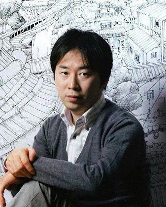

# Sasuke's Story: Sunrise (Naruto Novels)

## 🔖 Table of contents

- [x] [NarutoPedia](./en_naruto-pedia.md)
- [x] [Prologue](./en_prologue.md)
- [x] [Chapter 1: Dark clouds appearing in a world of change](./en_chapter_1.md)
- [ ] Chapter 2: Shadow of the past revived by lightning
- [ ] Chapter 3: Ostentatious welcome, roar of grief
- [ ] Chapter 4: Where the red eyes gaze
- [ ] Epilogue

> [Language versions](../../README.md#language-versions)

## 📖 Summary

> The Great Ninja War has ended, but to untangle the mystery that remains, Sasuke sets out on a journey-a journey that he hopes will allow him to atone for his sins. During his travels, those ninja faithful to the avenger Sasuke bring about tragedy. Meanwhile danger closes in on the villages of Konoha, Kiri, and Kumo, where red eyes burn with hatred. What is the future Sasuke stares down?

## ✍️ Author biography

  

Author/artist **Masashi Kishimoto** was born in 1974 in rural Okayama Prefecture, Japan. Like many kids, he was first inspired to become a manga artist in elementary school when he read Dragon Ball. After spending time in art college, he won the Hop Step Award for new manga artists with his story Karakuri. After considering various genres for his next project, Kishimoto decided on a story steeped in traditional Japanese culture. His first version of Naruto, drawn in 1997, was a one-shot story about fox spirits; his final version, which debuted in Weekly Shonen Jump in 1999, quickly became the most popular ninja manga in the world. The series would also spawn multiple anime series, movies, novels, video games and more. Having concluded the series in late 2014, Masashi Kishimoto has kept himself busy this year with the side story Naruto: The Seventh Hokage and the Scarlet Spring and writing the story for the latest Naruto movie, Boruto: Naruto the Movie, both of which will focus on the title character’s son, Boruto.