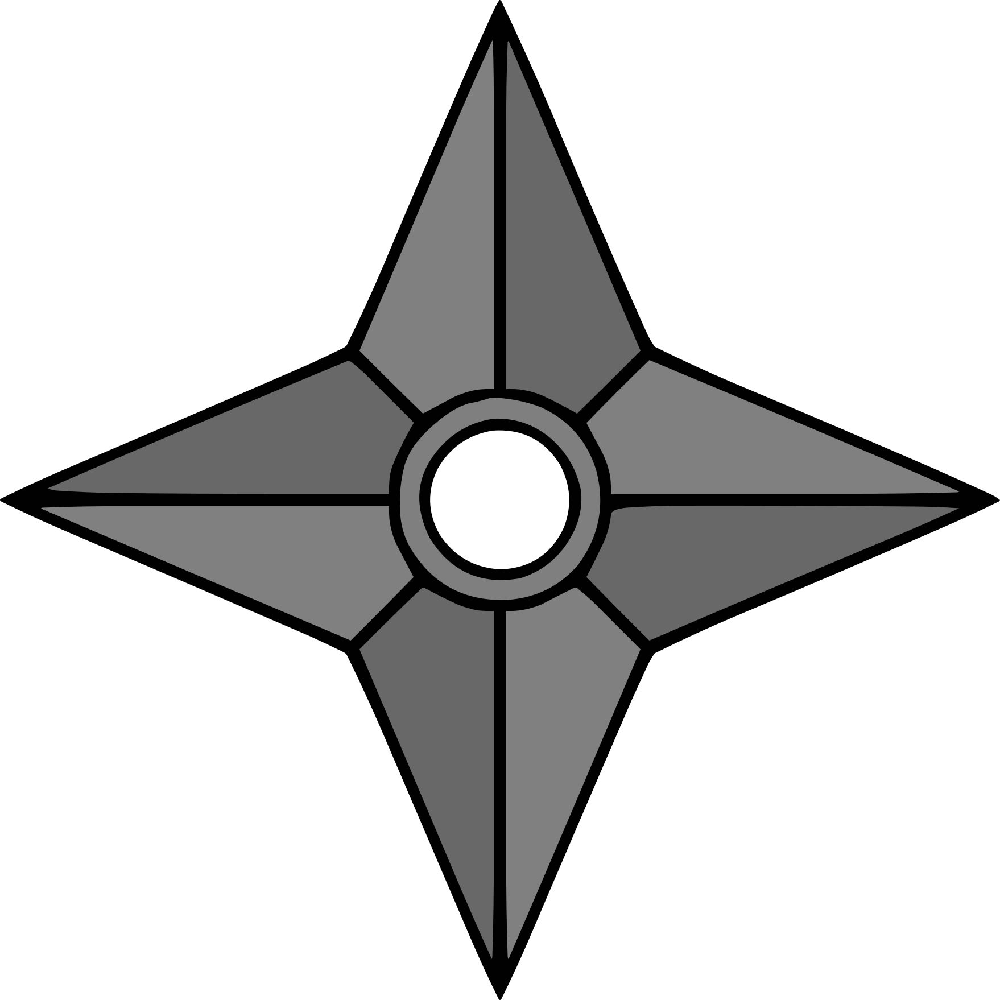

> [Table of contents](./en.md#-table-of-contents)

 

# Chapter 1
## Dark clouds appearing in a world of change

1.

"Give my best regards to the Lord Raikage as well". 
The vast ocean was veiled in white mist. Not particularly good for visibility, but the women were accustomed to fog; they cloud see quite well, even in these conditions. 
Enclosed on all four sides by the ocean, The Land of Water, one of the lands known as the five great ninja nations, was also home to the village of Kirigakure. The days when Kirigakure was known as the Village of the Bloody Mist and the origin of Akatsuki were in the distant past. Yagura, the Fourth Mizukage, had dirtied his hands with all sorts of evil, but the genjutsu cast on him had been released by the late Ao's Byakugan, and with Terumi Mei's assumption of the office of Fifth Mizukage, the situation in Kirigakure was steadily improving. 
And then, the Fourth Great Ninja War changed the world completely. The constantly quarrelling five great ninja lands had joined hands and come through the terrible battles together, becoming war comrades. Even after the Great War, they had worked together to overcome the difficulties that arose to sake the world. Many lives had been sacrificed in the war, and those who survived lived with great sadness, but the things gained were also great. 
"Please be thorough in your duties in the joint training between Kirigakure and Kumogakure!" Chojuro —carrying the large twinsword Hiramekarei that was proof that he was one of the Seven Ninja Swordsmen— called to the ninja preparing to sail away. 
The surf pounded against the port. A ship large enough to carry a hundred people was currently moored there, in this critical location for the Land of Water, surrounded by the sea as the country was. 
Some people has kicked up a fuss when the decision was made to train together with another village, but still the feeling of friendship was actually quite strong. The fact that they had exchanges like this with other lands was due in large part to Uzumaki Naruto and the many incredible things he had accomplished during the Fourth Great Ninja War. His hope was that ninja would come together to create a world without war. 
"These sorts of experiences will also be good for the future of Kirigakure", the Mizukage remarked to the squad leader in charge of the joint training group. 
"Yes, ma'am! We will be bold. Made for this mission, we will build a basis for friendship with other nations!" The squad leader responded sincerely to this hope of the Mizukage. 
But she reacted with a gasp. <em>Old maid?!</em> 
Utterly ignorant of the Mizukage's state of upset, Chojuro said to the squad leader, "The Lord Raikage is hard on both self and others at times. But he is a firm and brave man. He gives his all to everything he does. Also, this time of year, powerful typhoons often from around the islands neighboring the Land of Water, so please do not act rashly. Keep an eye out for them". 
"Ha ha! So now you worry about other people now, hm, Chojuro? Better off herding cats". 
<em>Old maid, hard on both self and other at times... Trash her?!</em> 
As Chojuro and the others chatted cheerfully, the look on the Mizukage's face grew grim, and an ominous aura rose up around her. 
Noticing her silence, Chojuro cocked his head curiously to one side and looked at her. "Lady Mizukage, is something the matter?". 
She exhaled a long breath and collected her scattered nerves.
"I just remembered things with Ao... If he were here..." 
"Oh, Ao... I wish he could see me now too". Chojuro had apparently taken her statement to mean she wanted to show off the now-grown Chojuro to Ao. 
Rather than correcting him, the Mizukage smiled and brought heir conversations together with a "Truly". 
"All right, then! We'll be off!" a ninja on the ship called, now that all members were aboard; the ship slowly left the port. 
"The five great nations hated each other so much, and now we can join hands like this", Chojuro murmured deeply moved, as they watched it sail off in mist of sea spray. "It'is simply incredible, isn't it?". 
"Yes, it really is". The Mizukage felt something more than this, than how Chojuro left the transformation of this changing world in his own way. She was one of the shinobi who has lived through the dark days of Kirigakure. She had fought, drenched in the blood of the others, in her own blood, for the sake of the village. 
Back then, if a ninja was determined to be a burden, they were simply thrown to the wolves. It had indeed been a time when everything was suspected, when they had lost sight of what they were living for, what they believed in, as if they has been in a thick fog. That environment had produced, among others, Momochi Zabuza, feared as a demon; Haku of the Yuki clan, toyed with by the sad destiny of kekkei genkai; and Hoshigaki Kisame, who bore the darkness of Kirigakure alone —so-called "evil" ninja. As a ninja from the same village, from the same era, however, the Mizukage secretly had complicated feelings about calling them evil. 
With the tensions among the five great nations easing, and thus, fewer and fewer battles, this world, formerly centered around fighting, was now changing from its foundations.
Which meant that both ninja and average citizens also needed to change to adapt to these new times. But not everyone could accept this. There were inevitably going to be people who rejected and despised the idea of this change, who would try to destroy this new world. 
In her struggle to undo the negative inheritance left by the former Mizukage and Kirigakure's own history, the current Mizukage, Mei, was coming up against all kinds of difficulties, so she knew. Change was no simple matter. 
The ship bound for the Land of Lightning had become a shadow in the distance in the blink of an eye. The Mizukage strained her eyes to follow the hazy ship disappearing into the white mist.

 

	

 

"It got cloudy all of a sudden". 
The Kirigakure ninja keeping watch on the deck of the ship looked up at the sky. It had been a day since the ship set out from the port in the Land of Water toward the Land of Lightning. After they slipped through the white fog, they had been blessed with good weather, but abruptly, black clouds started gathering above them. The wind blew against her cheeks, and the calm face of the ocean began to change. 
"A storm might be coming". The watch ninja took a step to go and report to the people inside. But she felt eyes on her somehow. Unconsciously, she turned in that direction and saw a small boat in the ocean, in the breaks between the waves. "A fishing boat?". 
Aboard the vessel were several people dressed like fishermen in straw raincoats and woven 'amigasa' hats. But there were many islands of all sizes in this area, and more than a few of their residents made their living fishing. There was no need to be particularly concerned. Or so she thought, but the boat was gradually heading toward them. 
"Hey! You're going to hit us!" she called out a warning, but the boat didn't show any signs of stopping. "Hey!" The watch ninja leaned over from the ship, grabbed her forehead protector with the Kirigakure crest on it, and held it up. Perhaps there came through in this a boast that they were ninja of Kirigakure, an unconscious arrogance that fishermen like them couldn't do anything about it. 
One of the people in the boat stood up. Woven hat deep over their eyes. Fingers grasping the edge, slowly lifting it. The hidden chin, the mouth, the nose were revealed, and then... 
The instant she saw the eyes, the watch ninja fell down. 
"H-hey! What's wrong?!" The eyes of the other ninja on deck grew wide at their comrade suddenly dropping to the deck after calling out a waring to the small boat ahead of them. But before any of them could race over to her side, they sensed an abnormal aura. 
"Wh-who's there?!" 
The mysterious person, face covered by the woven hat, landed soundlessly, alone, on the deck of the sip. From the way they carried themselves, there was no doubt they were a ninja. 
Hearing the commotion, the squad leader came running up.
"Seize them!" 
The ninja Kirigakure began to weave signs to capture and eliminate the intruder. They were on the water; given the number of the Water Style users in Kirigakure, they should have had the upper hand. 
However, the intruder calmly lifted the edge of the hat again. 
"Wha—!!" 
Young ninja with promising futures, veteran shinobi who had lived through the time known as the Village of the Bloody Mist and survived the Fourth Great Ninja War, all of them crumpled on the spot, unable to do anything against this alone ninja opponent.

 

	

 

"They're late". 
The ninja of Kumogakure grumbled, waiting in the drizzling rain to greet the ninja of Kirigakure at the port in the Land of Lighting. The scheduled arrival time was long past, and no message had come to say the ship would be late. 
"The Lord Raikage's going to lose it if they're too late". 
Their straightforward, short-tempered Raikage. If they kept him waiting too long, he would erupt in anger; he might very well bring the lightning of his name down on them. 
"Maybe the weather's not working with them. There's nowhere out on the ocean to get out of the rain, after all". 
"But they could at least send a messenger hawk from the ship, right? It'd make it easier for us to report to up high too, if they'd send a little note saying they're late". 
"That's true, but..." 
The wind brushed against the cheeks of the increasingly wetter Kumogakure ninja. After considering again the possibility that their arrival could be even further delayed, they decided to send a messenger to Kumogakure. 
"Hey, wait. Is that it there?". 
A ship has finally appeared on the horizon. 
"So they finally show up, huh?". 
The ship bore the mark of Kirigakure; it was clearly the one they were waiting for. 
"It's kind of really quiet, huh?". 
There was no one on the deck; they couldn't see any Kirigakure ninja. Perhaps they had gone into the cabin to avoid the rain. 
As the ship approached, the wind and rain grew more intense. Almost as if bringing something sinister. 
"Welcome to the Land of Lightning!" the Kumogakure representative called out, as the ship reached the shore. 
There was no response from inside. Thinking this suspicious, the Kumogakure ninja looked at each other. 
"Welcome!" she shouted again, her voice tense. 
Finally, someone appeared from within the ship. A ninja wearing a woven hat. This ninja glanced down at the representative who had called out to welcome the ship. 
"...Oh..." The representative swayed, and then collapsed on the rain-slick port. 
"Wh-what's wrong?!". 
The Kumogakure ninja were bewildered by this sudden event. 
The ninja in the hat jumped down from the ship and tossed the hat away, revealing what had been hidden beneath it. 
"Th-those eyes?!" 
Crimson eyes glowing eerily in the rain. Not one of the Kumogakure ninja escaped being caught in their gaze. 
"Crap, ocular jutsu..." 
Merely upon seeing that red glow, the ninja of Kumogakure lost all their strength and fell to the ground. 
"That was wonderful". Red Eyes' comrades leaped down from the ship after watching the scene play out. 
"Put them in the ship", Red Eyes instructed, and the other ninja nodded. 
The Kirigakure ninja were already inside the ship, fat on their backs, not moving so much as a muscle. 
While the others hauled the Kumogakure shinobi up, Red Eyes picked up the woven hat and put it back on. The weather grew increasingly rough, and the black clouds, stirred up by the wind, twisted like a giant snake. 
"We got them all!" one ninja shouted, and Red Eyes leapt up back onto the ship. 
A bolt of lightning raced across a sky rumbling with thunder. 
"We'll dye it all red". 
<em>I will nor allow this peace.</em>

2.

The woods were thick. Ivy twined around fat trunks, down to the roots of mossy trees, erasing the border between tree and earth. This particular tree that stretched its branches to the heavens, seeking the light of the sun, was hundreds of years old. But beyond it were young buds not yet grown. 
Someone was looking down on it all. The left eye that barely peeked out from the hair hanging across his face was the supreme Rinnegan. At first glance, the right looked to be a normal eye, but it housed the Sharingan, the kekkei genkai of the Uchiha clan. The man's name was Uchiha Sasuke. 
At the top of the massive tree, Sasuke looked out at the view in all directions. He had made it through the Fourth Great Ninja War and come back a shinobi of Konoha once more.
However, rather than staying in the village, he had set out on a journey. 
<em>I want to know how this ninja world —how the world looks to me now.</em> 
He had been traveling for several years, and had seen things he probably wouldn't have noticed when he was steeped in darkness. There had also been times when he looked back gently on the past he had tried to break free of. There were moments when he remembered his friends. He saw with his own eyes the scars of the war; he touched on people's sadness, and felt the futility of revenge. 
In the past, Sasuke had endured the pain and suffering of having his family and his clan taken from him with the powerful medicine of revenge. But in the depth of that darkness, he had become confused about what path to go down. He had lost sight of what was important. It had taken a very long time to be able to understand and accept that, but Sasuke truly felt it now. 
He felt the changes in the world as well. The five Kage had moved to make major wars disappear, and maintain peace and order. Once, the power of the ninja was used to protect their own countries, and to invade and attack other nations. Now, it was being made use of to develop equipment that did not require chakra to instantly transmit information, to maintain medical facilities, to actively communicate with other nations, and to enhance distribution systems, among other things. The world was stepping into a new age of growth. 
Which was exactly why he could not overlook one particular issue. 
<em>Otsutsuki Kaguya.</em> 
The woman who had taken in her mouth the fruit of the Divine Tree —said to be forbidden— gained chakra, and brought calm to a turbulent world. But she had been consumed by the immense power, and after a time when she ran wild, her own children, Hamura and Hagoromo, had sealed her away. 
The very Kaguya had come back to this world, and Sasuke had, along with this comrades in Team 7 and Uchiha Obito, sealed her away once more. Once the threat that had rocked the world had passed, people rejoiced, but something about it bothered Sasuke. 
Through Black Zetsu's secret maneuvering to bring her back, Kaguya has linked the people she cast Infinite Tsukuyomi on to the roots of the Divine Tree, transforming them over many years into her personal soldiers. The end result was the army of White Zetsu. 
Formerly known as the Rabbit Goddess, Kaguya changed somehow after she had freed the world from conflict, so the people connected to the Divine Tree also came after the peace she brought about. Why, in a world where fighting was supposed to have ended, was there a need to use the Infinite Tsukuyomi on people and turn them into soldiers? To play cruelly with those who had power, to control human beings with fear; a number of reasons came to mind, but Sasuke could see no clear answer. 
He was chasing after the traces Kaguya had left behind to clear away his doubts, but his opponent was the progenitor of chakra. Sasuke might have had the Rinnegan, but picking up her trail was no easy feat. 
"Mm?" Sensing an aura, he looked toward the southwest.
When he squinted, he could see something flying in his direction. At first glance, it was a small bird flapping its wings, but circulating in that bird was not blood, but ink and text brought to life by chakra. 
Sasuke quickly pulled out a scroll, and the bird flew toward it as if called. Konoha ninja Sai's Art of Cartoon Beast Mimicry.
The figure of the bird disappeared, and in its place, text spread out on the open scroll. 
Thinking that he needed to have a more diverse view of the world in order to know Kaguya, Sasuke had recently deliberately begun communicating with Konoha more often, asking them to send him information on the state of the village and of the world. 
He turned his gaze to the words on the page, thinking it was one of those missives, but his brow furrowed at the content.
"This..." 
It was a message from the current Hokage, Hatake Kakashi.
Apparently, a large number of ninja from Kirigakure and Kumogakure had suddenly disappeared. There was no sign of a fight, and information was limited, so the Hokage was asking him to contact Konoha if he found anything suspicious that might have been related to the incident. 
"More than a hundred ninja suddenly vanish?" 
If a person was behind it, it was posible that they were a genjutsu user. In which case, it would be best for Sasuke, with his superior ocular jutsu, to respond. If he used the Sharingan, he might be able to see what other ninja couldn't. 
At the top of the tree he had climbed to check his direction, Sasuke looked around once more with those eyes. Several clouds of white smoke puffed up info the air beyond the forest he was perched in. Not from fires, though. It was steam. He was that close to Yugakure, a village where hot springs welled up out of the earth, often used as a hot-spring resort. It was in the Land of Steam, which was not far from the Land of Linghtning, and ships always departed from there to the Land of Water. 
"Maybe I'll head for the Land of Lightning, then". Given that he could reach it via a land route, Sasuke first set his sights on the Land of Lightning, and dropped back down into the forest.

 

	

 

Until around the time the sun was setting, Sasuke charged forward silently, without resting, racing through a bamboo thicket. It was hard to jump through the supple, elastic bamboo the way he did with trees. As he moved across ground littered with bamboo leaves to quickly make his way out of the grove, Sasuke thought about the situation. 
He was still in the Land of Steam. He wanted to be in the neighboring Land of Frost by the time the date changed, and then in the Land of Lightning and the village of Kumogakure the following day. 
Abruptly, a small settlement came into his field of view. It was the sort of country village you'd see anywhere, but he unconsciously came to a stop. 
There was not a single light in the village. 
Although the sun had set, it was too early for everyone to have gone to sleep. And he had also just heard about the disappearance of a large number of ninja. 
Sasuke closed his eyes for a moment and focused his power in his right eye. When he opened his eyelids, the eye was dyed red, three 'tomoe' marks visible in it. Saringan. 
He looked at the village with that eye. There were indeed people inside the houses, which made ample use of the surrounding bamboo in their construction. But all of them were still like they were holding their breath. Almost as though they were afraid of something. 
His curiosity piqued, Sasuke took a step toward the village. 
"So you show yourself! You fallen Dark Thundeeeeerrrr!"
Someone leapt out with a great deal of force from beneath the bamboo leaves. 
Sasuke looked in that direction to find a balding old man, all skin and bones, charging at him, bamboo spear in hand. His movements were not quick, and he wasn't strong; he seemed to be a normal person with no connection with the ninja arts. 
Sasuke jumped backward and lightly dodged. But in the spot where he landed, he felt chakra behind him. 
"Water Release: Rain Barrage!" The high-pitched voice of a young girl rang out, and countless tiny pellets of water like the icing sugar on a sweet cake flew at him. 
Sasuke wove signs, took a breath, and brought a finger to his mouth. <em>Fire Style: Great Fireball Technique!</em> 
Fire Style was the specialty of the Uchihas. The flames he released enveloped the water pellets of his opponent, evaporating them instantly. 
"What?! Water Style can be done in by Fire Style?!" his opponent shouted, upon seeing her own technique disappear without ever touching Sasuke. He looked over and saw a short girl with a childish face standing there. 
"Chino, get back!" Now a brawny man appeared, as if to push the girl "Chino" back. Kunai at the ready, he tossed it at Sasuke, the tip aiming straight at his heart. 
It stabbed into the bamboo behind him. <em>Rrrrrip!</em> The oversized grass exploded backward. 
"Wind's changing nature hm?" Sasuke noted. The kunai, cloaked in wind chakra, had expanded the air inside the node of the bamboo and ruptured it. 
"Hey! You youngsters, what are you at?! Hurry up and take him down!" the old man shouted. 
"Whaaaat?! No one told me he was this strong!" Chino frowned and stared at Sasuke. And then she gasped and pointed at his eye. "No! No way! Look, Nowaki! That eye... the Saringan!" 
A surprised look rose up on the face of the large man, who was apparently Nowaki. "Is that real?" 
You listen, you spineless brats! You're gonna be like that, then I'll do it! Dark Thunder, I'll get vengeance for my daughterr!" Clutching his bamboo lance, the old man charged once more. 
Sasuke didn't have a chance to even ask what was going on; in any case, he had no choice. "Hah!" He pushed out a hard breath, and took his sword in hand. 
"Diiiiiiiieeee!" The old man pushed the bamboo lance forward. 
Sasuke easily cut the end of it off. With incredible speed, he then sliced the lance into thin rounds up to the old man's hand, before bringing the tip of his sword up against the old ma's windpipe. Sasuke pressed the blade against his throat as if to make him keenly aware of the cold sensation of the sword. 
"Ee, eeep". The bamboo, chopped down to a single joint, fell from the old man's hand. Droplets of sweat popped up on his dry skin and fell to the ground. 
"Ah, ah w-wait, brother! Boss! Handsome! Manly! Don't kill the old man!" Panicked, Chino came at Sasuke as if to calm him. 
Not responding to this, Sasuke said to the old man, "You've got the wrong idea". 
"Hah, hah..." 
"I don't know this Dark Thunder". 
"Eee, eee..." Sasuke's words didn't seem to make it into the old man's ears; he kept breathing sallowly, trembling with fear.
They wouldn't get anywhere like this. 
Sasuke moved the blade of his sword the tinest bit away from the old man's throat. "I am not Dark Thunder". 
"What?" 
"That's the first time I've heard the name". Sasuke lowered his sword, and the old man crumpled to his knees on the spot. 
Meanwhile, Chino and Nowaki looked at each other. 
"Iou! He says it's a mistake!" Chino shouted. 
But the old man Iou's moaned, "Shut up! This isn't the time for that! My heart, ah! My heart huuuurts!" Released from the terror of death, Iou's body responded with intense heart palpitations. He pressed a hand to his chest, and desperately sucked in air. 
"Sorry. That was a terrible mistake for us to have made".
Unlike Iou, Nowaki seemed sincerly apologetic. 
"Although I feel like we would have been the ones to be killed if the fighting continuaded, I am sorry", Chino added, clapping both hands together in a gesture of contrition. "C'mon, Iou!".
You say sorry, too! 
Sill on the ground, Iou turned his face away. "Hmph! It's his fault for coming through Takeno at a time like this!" he cursed. 
"Oooh, damned old man!" 
"What did you say?!" Spurred on by Chino's words, Iou tried to stand up, but he quickly sat down hard again. Apparently, he had thrown his back out as well. He pounded the ground in vexation. "Ngh! And I thought for sure we'd settle things with the Dark Thunder gang today!". 
"Exactly what is this Dark Thunder gang?" Iou had said he was going to get revenge for his daughter. There was no doubt something was happening here. 
"Um, that story's a long one. ...Iou, let's go home for now. We have to explain things to the man here". 
Like a stubborn child, Iou turned his face away. Chino grumbled an exasperated "Come onnnnnn", and then signaled Nowaki with her eyes. 
"We're going back now, Iou". Nowaki hauled Iou up off the ground. 
"Hngh!" the old man cried. 
Nowaki started to walk toward the village, and Chino followed, hands clasped behind her head. Sasuke stared at their backs; Chino looked back to urge him on.
"Hurry up!" 
"This looks like it's going to be a hassle", Sasuke murmured as he moved to follow the three. But then he sensed eyes on him and whirled around. 
Sasuke surveyed the scene, but there was only the bamboo forest spreading out before his eyes. It was quiet, no sign of any beast. 
"Brother what's the matter?" Chino called out, concerned. 
Sasuke looked the bamboo thicket over once more before following after her.

 

	

 

They brought him to Iou's house. Apparently, Iou was the mayor of this Takeno, and his home was remarkably large. Inside were all kinds of items made of bamboo, from everyday accessories to children's toys. 
"So, like, Takeno apparently sells these bamboo crafts to make a living". Chino showed Sasuke the bamboo wicker baskets, skewers, and fishing rods, among other items off to one side. 
"Don't go touching things!" Iou snatched a skewer from her with a snarl, but Chino wasn't put off in the least; she picked up a bamboo dragonfly and set it flying through the room. Unfortunately, it looked like it was going to land on top of Sasuke's head, but he caught it before it did, and held it up in front of him. 
"I guess they sell all these in Yugakure. There's a lot of tourists there", Chino noted. "But the prices are too low, so they barely make anything off them". 
"Quiet, you!" Iou roared instantly. 
Yugakure was the rare ninja village that was also a tourist destination. And judging from the piled-up baskets and the large number of skewers in the work area, there seemed to indeed be a demand for the items, but life was apparently still hard in this village. 
"Actually, me and Nowaki performed in Yugakure a little earlier". 
"Performed?" Sasuke raised an eyebrow. 
"We're shinobi has-beens, traveling performers. We made some real coin in that onsen town. You can really clean up in entertainment there". Chino breathed out, and soap bubbles appeared, one after another. For a shinobi, it wasn't much of a trick, but it was probably well received by the average person.
"So. We were heading off to a different area when we came through Takeno, okay? We stopped at the store for food, and this old man grabbed onto us. He begged us to help him get revenge, and then cried all over us". 
They were finally getting to the subject at hand. As if compelled by Chino's story, Iou shouted, "It's all because of Dark Thunder! They're a heartless, soulless, evil organization! They come after tiny villages and pillage them! They kill people for sport! A few months ago, they came after the village my daughter married into... and they killed everyone!". 
So that's why he was talking about revenge. 
Perhaps remembering his daughter, tears sprang up in Iou's eyes. "We weren't blessed with children, and then after we got old, finally, my sweet baby girl! She got married last spring. She was going to have a baby soon!". 
Seemingly unable to put his feelings into words any further, Iou gritted his teeth like he was trying to hold back his tears. 
"He said his daughter was killed and his wife took sick from the shock of it and died", Chino finished. 
Tragedy begets tragedy, and now all only Iou was left. It was a terrible situation —no wonder he had been driven to vengeance. 
Having silently listened thus far, Nowaki looked pityingly at Iou. "Apparently, the people of this area fear this Dark Thunder and live their lives in dread. Look at the windows". 
When Sasuke did as instructed, he saw that blackout curtains hung over the windows so that no light leaked out. The people in the other houses likely had the same setup. 
So that's why they had lain in wait, and tried to take down the Dark Thunder group. 
"Now, you! You're strong, right! Please! Help me!" Iou roughly wiped his eyes with the back of his hand as he asked Sasuke for his help, almost throwing himself forward. 
"What? Isn't that a bit too selfish?" Chino sounded exasperated. 
"Shut up!" Iou roared at her, and kept going without a pause. "I apologize for before!" He threw his head down in a deep bow, and then didn't move to bring it up again. Was he planning to keep bowing until Sasuke said yes? 
Unable to just stand by and watch, Nowaki lowered his voice and said, "I'm not with Iou or anything, but actually, the leader of this Dark Thunder group is apparently saying his master is Uchiha Sasuke. And he's broadcasting it to the world". 
"What did you say?" Sasuke unconsciously furrowed his brow at the sudden appearance of his own name in the conversation. 
"That's you, right? Uchiha Sasuke. I guess he really looks up to you or something". 
Unlike Iou, Chino and Nowaki had an understanding of ninja. And they were traveling performers. They would be privy to information as they journeyed around the world. It was precisely because of this that they had guessed who he was right away, once they saw his Sharingan. 
Sasuke had never heard of anyone calling themselves Dark Thunder. He was naturally annoyed at someone using his name however they pleased, but more than that, the fact that people out in the world doing evil were openly respectful of him shot a shadow of gloom into his heart. The shadow was dark and heavy. 
"That's that, then", Sasuke murmured, slowly. Now that his name had been brought into it, he couldn't say it had nothing to do with him. 
And it was a fact that the Dark thunder group was violent, with many victims, and this village was exposed to that terror.
The disappearance of a large number of ninja concerned him too, but he couldn't exactly walk away from this village. The reason Sasuke was on this journey was also to atone to the world, after all. 
"Huh? You're gonna help?" Apparently, Chino didn't think Sasuke would help them. She looked at him with wide eyes. "I figured you'd say 'not my problem', or 'fix it yourselves', and then flip the table before taking off". 
First of all, he would never flip a table, but the old Sasuke probably would have indeed said that. To begin with, the old him would have quickly passed through this village, and headed straight for the Land of Lightning. 
"So you'll do it! You are the man I thought you were!" Iou raised his head, and a broad grin spread across his face. The change in his attitude was whiplash inducing. 
Seeing Iou like this brought another person to mind. Tazuna, the bridge-builder from the Land of Waves. Tazuna had struggled against various obstacles to build his bridge, and he had the same audacity and quick-changing attitude. Maybe it was a special characteristic of this generation. 
But the paths the two men had gone down were exactly opposite. Even after his loved one had been killed, Tazuna risked his life to fight for the future of the land, while Iou was spurred by hatred to see the power of vengeance. 
"At any rate, that's enough for today, right? It doesn't seem like the Dark Thunder Group is gonna show. Let us rest". Chino made a show of yawning hugely. 
"I s'pose. There's rooms here. Use 'em if you want. ...And if they do come, I'm really counting on you", Iou said, as if to drive the point home. His eyes showed that he was certain that this village was going to be attacked. And deeper in those eyes was a darkness that sought punishment for Dark Thunder for killing his daughter. 
Even if Sasuke helped to resolve this incident, he had no intention of lending a hand to revenge. Although Iou likely wouldn't accept that. Instead of answering the old man, Sasuke went into the room he had been given.

 

	

 

"Huh? Say that one more tiiiime". 
A small village nestle in the mountains. But there were no longer any villagers in it. Destroyed houses, people cruelly forced to breathe their last. Only the beasts that caught the scent of blood were lively. 
Inside a ruined house, the man sitting on the table and tossing a ball at the wall turned up the corners of his mouth at his subordinate's words. Bluish-purple hair tied back loosely, pale lips. Only his eyes glittered and shone. 
"Yes sir! Not long after the sun had set, when we went to scout out Takeno, there was a man using the Sharingan! Lord Karyu, it was most likely Uchiha Sasuke!". 
The ball hit the wall and bounced off the blood-soaked floor next to a corpse, and then returned to the man's —to Karyu's— hand. 
"Uchiha Sasuke. The sole survivor of the proud Uchiha clan. So he's in Takeno..." Karyu chuckled softly and jumped down from the table before throwing the ball up against the wall once more. 
<em>Thuk!</em> There was a loud explosion, and the subordinate involuntarily plugged his ears and closed his eyes. When he opened them again, there was a large hole in the wall, and Karyu had stepped through it and gone outside. 
Looking up at the moon hidden among the clouds, Karyu stretched out his hands. "My heart's teacher, the man who showed the world the wonder of kekkei genkai, Uchiha Sasuke... that I would get the chance to kill him!" A look of delight came across his face, and he shouted to his subordinates on standby, "All of you, get to work! Just the right time for Takeno... smash it all to pieces!"

3.

The massive A-un gates connecting the village with the outside world were closed now, as if to escape the darkness of night; the enormous rock wall with the faces of the six generations of Hokage carved into it was quietly illuminated by the light of the moon spilling through the clouds. 
Ancient even among the ninja villages, the Land of Fire's Konohagakure. This village, which had once taken catastrophic damage from Akatsuki's Pain, now shone even more brightly than it had in the past, and the population, which dropped during the Fourth Great Ninja War, was gradually recovering.
Everything appeared to be going well, but every era inevitably had its trials. 
"Hmm. This is actually a tough one" 
The Hokage's office. 
Looking over the letters that had arrived from Kirigakure and Kumogakure, the sixth Hokage, Kakashi, sighed. The missing shinobi were master hands. And with the ninja of Kirigakure, a hundred shinobi had disappeared all at once, together with a ship. 
According to Kumogakure, someone who had seen the Kirigakure ship in the ocean near the port in the Land of Lightning. In which case, it was possible that the ship had docked at one point at the port of the Land of Lightning. So maybe the Kumogakure ninja had gotten on the ship and gone somewhere with them? 
But it was not going to be helpful if they had actually fled across the ocean. They wouldn't leave any footprints or scent; in the wide ocean, even the ninja dogs Kakashi could summon, all them excellent trackers, would have a hard time finding the missing ninja. Kirigakure and Kumogakure were no doubt both at a loss for what to do. 
If this were the past, the details of this incident would have stopped at the borders, but the letters seeking information had been sent to Konohagakure, Iwagakure, and Sunagakure —ninja villajes of the five great lands— and now the information seemed to be spreading even further. Although this was another village's problem, it was not a stranger's problem. 
When the information arrived, Kakashi conveyed it inmmediately to the ninja of Konoha. And to Sasuke, who was traveling the world. Kakashi suspected that genjutsu was involved.
Although neither Kumogakure nor Kirigakure had any specific theories, they likely thought the same thing. And it had to be an unknown genjutsu. That was the only conclusion he could come to when he thought about the fact that so many ninja had been unable to grapple with it. Sasuke probably thought the same thing after reading Kakashi's letter. 
Sasuke had left on his journey for information and atonement, saying something bothered him. Unlike the ninja in the village, he had some room to maneuver. And more than anything else, he had the Sharingan and the Rinnegan. Things other ninja couldn't know might be seen with his eyes. 
"Sixth". 
He heard a knock on the door of his office. Identifying the voice as that of Shizune, former Hokage Tsunade's student, he called out, "Yes, come in". She was kind enough to be his assistant as well. 
The door was slightly ajar; Shizune poked her face through with a concerned expresion. "Excuse me —Sai says he has a report", she informed him. 
He had asked Sai to get in touch with Sasuke. So it was probably a report that his message had reached him. 
Shizune looked worried, but Kakashi said, "Sure, show him in".
"All right, then". Shizune opened the door, and looked over her shoulder. "Excuse me". 
"Hello!" Sai walked in with his usual somehow smarmy smile on his face. Behind him was Haruno Sakura, looking apologetic. A question mark popped up in Kakashi's mind. 
Behind Sakura, one more person came into the room. "Hey!" Master Kakashi!" Playing the fool with an unboundedly cheerful smile was the man who had saved the world in the last Great War, Uzumaki Naruto. 
Sai was one thing. Why were Naruto and Sakura here? 
"Of course it would be you, too". 
Naruto clasped his hands behind his head and cackled. "Sai said he was coming to see you, so I just tagged along". 
Without the slightest compunction. 
"You too, Sakura?" 
"I was looking something up with Shizune". 
So when Sai and Naruto asked Shizune for a meeting with the Hokage, they had noticed Sakura there and invited her along, then. 
"Anyway. How about I hear your report, Sai?" 
"Right. My messenger safely reached Sasuke the other day". 
"The Cartoon Beast bird flew off to the northeast, hm? In which case, judging from the number of days, he's around Yugakure or Shimogakure, maybe?" 
Hearing this, Sakura let out a sigh of relief. Sasuke was still alive somewhere. She felt easier, just knowing that. 
"So like, Master Kakashi, any progress in the disappearances?" Naruto unclasped the hands behind his head and looked at the letter in Kakashi's hands. He was clever times. 
"Apparently, there's no evidence or anything". 
"Sixth, something's bothering us about this incident", Shizune said. 
Sakura nodded and stepped forward. "It seems that we're seeing ninja missing from Konoha, as well". 
"What?" Kakashi started to rise from his seated posture. 
"It's not on the same large scale as in Kirigakure or Kumogakure, but there were several cases about three months ago. There might also be others that just weren't made public". 
Even now, they had many dangerous missions, and sometimes, ninja did go missing. And because they had more frequent contact than before with other regions, there were more people coming and going. So this wasn't a special, rare ocurrence —but something bothered Kakashi about it, too. 
"Why were you looking into something like that, Sakura?"
Sakura was very busy as a medical ninja, and the fact that she was looking into something of this nature was a little unexpected. At his question, her gaze froze slightly. 
"A regular at Ino's family's shop went on a trip and disappeared. Ino said he wasn't the sort of person of suddenly vaninsh, and when I heard about this case, I immediately remembered him". 
Yamanaka Ino was a female ninja, Sakura's rival and best friend. Her family ran a flower shop, where Ino also worked from time to time. The sight of Ino worried about a regular customer had probably stuck in Sakura's mind. 
"I thought I'd tell you once I learned more details". 
Given that this was Sakura, there was no doubt she had been planning on telling him once she had looked into it enough to be sure. 
"Oh, thanks. I'll keep an eye on it too". 
Although the person on top was thought to have all the information, he actually did't. For better or for worse, people sifted through information, deciding what was and wasn't worth telling the Hokage, so a lot of information never reached his ears. Which was why it was vital for him to hear the opinions of people he knew like this. 
<em>Good thing Sakura's story got to me at the right time</em>, Kakashi thought as he turned his gaze to Naruto, who had brought Sakura in to begin with. It was at that moment... 
"Sixth! There's an invader in the village!" A ninja from the barrier team appeared suddenly in the Hokage's office. Tension ran through the room. 
"Did they touch the barrier?" 
A spherical barrier had been set up around the village of Konohagakure, from the ground up into the sky. After the attack by Akatsuki, they had put up an even more powerful barrier. 
"They...they're already inside the barrier, all the way to A-un gate..." 
"What?!" 
"The ninja of the barrier team are currently on their wa—"
The end of the word didn't make it out. 
<em>Boom!</em> They heard a sound like an explosion from somewhere. Kakashi and the others opened the windows of his office and looked outside. 
"Master Kakashi, flames..." A fire had broken out in the direction Sakura was pointing, near the A-un gates, perhaps an effect of the explosion. 
"Master Kakashi! We'll go to check it out right now!" Naruto said. 
Sai swiftly opened up a scroll hanging at his hip and sent his brush racing across it. The ink drew out a large bird with its wings spread. "Ninjutsu! Art of Cartoon Beast Mimicry!" 
The bird flew up from the scroll as if being born and spread its large wings outside the window. Flapping them, the bird first allowed Sai to leap on; then, Naruto and Sakura followed suit. 
"Do it", Kakashi said, tersely. 
Naruto nodded, and the three flew off in the direction of the flames licking up into the air. 
"Sixth, I'll go give the order for firefighting activities!" 
Shizune said, and Kakashi nodded in her direction before giving the order to gather information in all areas. He glanced at the letters from Kirigakure and Kumogakure laying on his desk. 
"What exactly is going on here...?"

 

	

 

On the back of the enormous Cartoon Beast bird Sai had drawn, Naruto and the others hurried in the direction of the gates and the nearby fire. But when they were halfway there, Sai scrape against the roofs of buildings. 
"Sai, what's gong on ?!" Naruto shouted in surprise, when he spotted a three-person cell ahead of them racing along the rooftops toward A-un gate. "Oh! Shikamaru?!" 
Sakura leaned forward and looked down. "Ino and Choji too! Sai, I can't believe you noticed them!" 
The group of Ino-Shika-Cho had also apparently heard Naruto and Sakura. 
"You guys're heading for A-un gate, too?" Shikamaru shouted, looking back. 
"Get on!" Sai called out. 
The three jumped up onto the enormous bird, and although the bird staggered and nearly crashed into a building the instant Choji was on board, Sai managed to get them flying high again immediately. 
Naruto and the others looked once more at the three new arrivals. Shikamaru, Ino and Choji were childhood friends, and they had previously joined together in a three-person cell under Sarutobi Asuma. However, now they each had their own positions, and didn't often work as a team anymore. 
"Ino and her mother asked us to, so we've been chasing after traces of the regular customer from the flower shop", Shikamaru explained, reminding Naruto of Sakura's investigation and what she had reported to Kakashi. 
"You find any clues?" he asked. 
"We found the inn that was probably the last place he stayed", Shikamaru replied. "The mistress there said he was on his way back to Konoha after a hot-spring treatment". 
That meant that this customer hadn't planned to disappear. 
"So then something happened on his way home", Naruto remarked. 
Ino nooded firmly. "He—his name's Tadaichi, by the way. He lost his wife young. He's the sort of person who'd buy flowers at our shop and offer them to his wife whenever he had the time.
He used to be active in the Anbu, but now he's fairly well on in years. He retired as a ninja this year, and when he came and said goodbye, he told us he was going to go around to the places where he spent time with his wife". He'd been a regular customer since Ino was a little, so she was fond of him, unsurprisingly. 
"Look. There's the whole thing with Kiri and Kumo right now right? We're worried he got dragged into all that", Akimichi Choji interjected. "They're also investigating in Kumogakure, but it was raining at the time, so the scent got washed away.
It's hard to find traces of him". Choji was in contact with Karui, a female ninja in Kumogakure, so he could get independent information. 
"At any rate, before all of that, we need to do something about this situation", Shikamaru said, putting a stop to that conversation. He looked toward A-un gate. Within the gates, which were locked at night, flames licked up into the air inside of Konohagakure. 
"Shikamaru, we were just at Master Kakashi's, and apparently, there's an intruder in the village", Sakura told him.
"Ninja from the barrier team are supposedly already on their way there". 
"So then if we can spot the barrier team, we'll know the enemy?" Shikamaru said, and Naruto leaned far forward, straining his eyes. 
"Over there!" Naruto's gaze was resting on the barrier team.
They appeared to be fighting enemy ninja. 
Shikamaru spotted them at the same time. He furrowed his brow. "What? They're totally on the defensive?" 
Just as he noted, the ninja of the barrier team were retreating, almost as though they were trying to avoid actually fighting.
Some were already injured, lying on the road. 
"Huh?!" Ino suddenly cried out. 
"What's wrong, Ino?" Sakura asked, but Ino didn't respond, instead moving to jump off by herself. 
"Ino, that's dangerous". Sai grabbed her arm to stop her. 
Ino's eyes were still on the enemy attacking the barrier team. "It can't be..." 
"What's wrong, Ino?" Choji asked, seeing all the blood drain from her face. 
Her lips trembled. "Tadaichi". She forced the name out. 
"Huh?" 
"It's Tadaichi" 
A shock ran through the group. The man Ino called Tadaichi was clad in travel gear, and the look on his face was blank, like it had been scraped off. 
"You're sure, Ino?" Shikamaru asked. 
"I'm totally sure! But he's not the kind of person to turn on Konoha! Why..." 
"So then..." Shikamaru looked down on Tadaichi, "Is there a possibility he's under a genjutsu...maybe?" 
This time, Sakura gasped. She looked at the faces of the other enemies. "It might be exactly that, Shikamaru". 
"What do you mean?" 
The information she had just been reading on the missing people came back to life in her mind. "It's the people who went missing" 
"What?!" 
"They're Konoha ninja! They might all be!" 
Shikamaru clicked his tongue and looked at the ninja of the barrier team. "So that's why they've been forced into a defensive battle!" 
Someone on the barrier team had likely realized that the enemy warriors were Konoha ninja. But if it was genjutsu, then there was a chance they could be brought back to their senses with a counter-genjutsu. The barrier team was no doubt fighting with that very idea in mind. The attacks they threw at Tadaichi were too weak to kill. 
"Wait, that", Naruto said. "What's that about?" 
They felt a wave of pressure, like something swelling up and coming toward them. 
Injured by the barrier team's attack, Tadaichi fell to the ground, and his body began shaking. 
"Ah! This is bad!" Naruto immediately leapt off the bird. 
<em>Shadow Clones!</em> As he wove the signs in midair, his shadow clones landed next to the various members of the barrier team. 
"Naruto?!" 
"We're flying!" Without giving them a chance to say anything, Naruto lifted up the ninja of the barrier team, and all departed from the place at the same time. 
When he looked back, Tadaichi was slowly getting to his feet. Despite the fact that he was injured, his face was still expressionless. The blood spilling out of his wounds frothed and bubbled. And that wasn't all. Lumps popped up all over his body, almost as if there were another living creature inside him, crawling around. 
"We gotta get further back!" Naruto got more distance from Tadaichi before putting the barrier ninja down in what was probably a safe place, and then starting to run back to Tadaichi to try and help him. 
But the lumps seething through Tadaichi's body swelled and grew larger, and his skin, unable to contain the growth, split.
And then— 
<em>Boom!!</em> He exploded violently like he was bursting open. The houses closest to him were unable to hold up against the impact of the explosion and were destroyed. Fortunately, Naruto's shadow clones had gone to check on and bring out the people in the buildings nearby, so there was no human damage, but new flames rose up into the sky. 
"Are you okay, Naruto?!" Sakura cried, as Sai's Cartoon Mimicry bird landed and they all raced over to Naruto's side. 
"Tadaichi..." Ino stared dumbfounded at the scene, bits of flesh flung everywhere. Sakura placed a concerned hand on her back. "I'm okay". She pulled herself together, and immediately ran over to the injured members of the barrier team with Sakura. 
However, the threat had not ended. 
"Hey, don't they seem kinda weird?" Shikamaru's face hardened as he stared at the ninja of Konoha, likely under someone's control. Until moments ago, they had been baring their teeth at the members of the barrier team, but now they suddenly turned their backs to them and started running. The Konoha ninja then spread out their hands on the wall that surrounded Konohagakure, and clung to it. 
Naruto gasped. "No way! Them, too?!" He stared hard at their bodies. They were all injured somewhere —probably injuries from the explosion of Tadaichi. Blood oozed out of their wounds, and just like before, it was frothing. A chill ran up Naruto's spine, "Shikamaru! They're all gonna explode!" 
"What!?! If we have several explosions like that one at the same time, this whole area could be sent flying!" 
There were nine Konoha ninja left. Their bodies began to transform and swell up, as if things inside were pushing outward. 
Shikamaru clicked his tongue. "Can you make some wings with Art of Expansion?!" he yelled at Choji. 
"G-got it!" Choji opened a bag of chips he had hidden on him, and shoved them all into his mouth. As he hurriedly chewed them up, he concentrated his power in his body. "Aaaaaaaah!" 
The secret technique of the Akimichi clan. In the blink of an eye, Choji's body became enormous, and butterfly wings sprouted on his back. This technique used a vast amount of chakra. Choji's cheeks, usually swollen, were carved out in sharp relief. 
"How long 'till they explode, Naruto?!" 
"Maybe ten seconds!" 
Nine, eight, seven— 
"Got it! Everyone, behind Choji! Hold onto something solid!" 
Six, five, four— 
"Choji, now! Flap those wings with everything you've got!" 
"Aaah!" Having quickly grasped Shikamaru's intention, Choji braced himself and flapped the massive, chakra-made butterfly wings. He sent all of his own chakra out on the wind they created. 
Three, two, one— 
<em>Booom!</em> The noise of the explosion. And again and again. A series of these, and the bodies clinging to the wall were ripped apart all at once. 
Shikamaru checked the front, and then yelled, "Here it comes!" 
When the shock wave came toward the village of Konoha, it collided with the wind radiating outward from Choji's massive body. The wind hit the shock wave, and the two fought. 
"I got your back!!" Naruto shouted. "Here we go, Kurama!" 
<em>Right!</em> 
To reinforce Choji's wind, Naruto called up the nine-tailed Kurama, once a source of hatred, now his partner. Power raced through his body, generating a Wind Release: Ransengan that he sent flying toward the shock wave. This new wind pushed back the shock wave to protect the village. 
"All right. Nice!" 
After wrestling with Choji's wind, the shock wave was bounced back beyond the village with the added force of Naruto's Wind Release: Ransengan. The trees of the forest just outside the gates were whipped around by the combination of wind and shock wave and flattened. 
"Hah, hah...Did that. Do. The trick?" Choji released his jutsu, breathing hard. 
Part of the wall enclosing Konoha was destroyed, but there appeared to be no damage to the village. The flames rising up inside the village had also been blown out. 
Shikamaru patted Choji's shoulder. "Nice work". 
Sakura raced over to the broken wall, but her shoulders dropped with regret. The bodies had been turned into hunks of flesh beyond repair. Ino also bit her lip. 
"At any rate, we gotta report to the Hokage. Sai, sorry, can you take us with your Cartoon Mimicry?" Shikamaru quickly gave instructions. Naruto also moved to follow Shikamaru. 
"Naruto!" 
Just as Sai pulled our his brush, they heard someone suddenly call out Naruto's name. They looked in that direction and saw a man with wide-framed sunglasses and spiky black hair swept up and back running over to the scene. 
"Huh? Who're you again?" The man looked familiar, but his name wouldn't come out. 
"Yamashiro Aoba!" 
"Yamashiro Aoba?" 
"We went to Turtle Island in Kumogakure together!" 
"Ohh! Yeah, right! Huh? What? You going to Turtle Island again?" 
"Not that! I'm a messenger from the Hokage!" Aoba shouted out the main point, sensing a danger that the conversation would continue to go in this strange circle. 
"From Master Kakashi? What's he say?" 
"Earlier, intruders were detected by the barrier. They number thirty". 
"What?!" they all cried out in surprise. Thirty —three times the attack just now. 
"Does that mean new intruders?" Sakura asked. "They were detected this time?" 
"Yes". Aoba nodded. "They're heading this way now". 
Naruto felt eyes on him from the woods on the other side of the destroyed wall. "There!" 
From the dark woods, first, a lone man. He was followed by one more, and then another. 
"That may be..." Sakura murmured, a bewildered look on her face. 
They were wearing ninja uniforms. But they were a mix of Kirigakure and Kumogakure uniforms. The marks of those two villages were also carved into their forehead protectors. 
"This looks like it's gonna be a drag", quick-thinking Shikamaru grumbled. "Naruto, you guys were with the Sixth —Master Kakashi, right? You heard that someone had invaded the village, and you came running to the scene. From all this so far, I'm guessing that the barrier team didn't notice the first intruders until they were in the village". 
"Y-yeah". 
Shikamaru talked as though he had actually been there himself. "Although they were being controlled by someone, Tadaichi and the others were Konoha ninja. That's why they were able to slip through the barrier without being noticed. They were probably just a teaser, at best". 
The army corps of mind-controlled ninja was slowly approaching. Dull eyes that gave no impression of will. This was the main force. 
"On top of that, there's a good chance that these guys here now are the missing ninja from Kiri and Kumo. Honestly, it's just one thing after another". Shikamaru scratched his head. 
"Shikamaru —the trigger that makes them explode is probably getting hurt. Their wounds emit a strange chakra and starts the transformation of their bodies". Just like Naruto had noticed their wounds, Sakura had also apparently picked out the trigger for the explosions. 
"In which case, we can't be careless with them". A serious look rose up on Shikamaru's face as he stared at the approaching ninja. 
And this situation was not just happening in Konoha.

 

	

 

"Why would the ninja from the alliance training corps be here?" 
Unlike Konoha, where few of its own ninja had shown up, Kirigakure had had several dozen of their own thrown at them right from the start, and these ninja had made it into the interior of the village. Fighting to defend Kiri's key facilities, Chojuro gritted his teeth at the smoke rising up in every direction. 
"Chojuro, the evacuation of the elderly and the children is complete", The Mizukage appeared before him to report the end of the evacuation. "I'm going". She started to run off to the central area of the battle. "Tell them to follow me. I have a duty to protect the people of the village. That...means them too". She looked at the smoke wafting up in tufts, unlike the fog that always hung over the village. These mind-controlled people were also ninja of Kirigakure. 
"I'll protect you, Lady Mizukage —the village of Kirigakure...absolutely!" 
"Mm, I'm counting on you".

 

	

 

"Boss! Please leave this to us! Sorry!" 
"Ngh!" 
Similarly, the ninja of Kumogakure also stared at their completely changed comrades. The Raikage was itching to join in the fight, but Darui, the Raikage's right hand, saw that there was a risk of causing more damage if he did, so he was holding the village chief back. 
"Shouldn't we be calling Killer B?!" Omoi brought up his mentor Killer B, imagining the worst-case scenario. 
"There'll be too much chaos!" all the ninja arround him shouted. 
"C, haven't you detected the true identity of the enemy yet?!" Darui turned his gaze on the sensor ninja C. 
C frowned and shook his head from side to side.

 

	

 

Their opponents were ninja under a genjutsu. And if you hurt them, they exploded. They had no will of their own. What on earth were they supposed to do? 
"Naruto!" 
A new voice rang out. He turned around and saw a woman running toward him, long hair swinging. 
"Hinata?!" 
"After you noticed Tadaichi's explosion and jumped back, I called her through Ino", Shikamaru said to the stunned Naruto. 
Born into the main family of the Hyuga clan, Hinata was the possessor of the Byakugan. She had a wide field of vision and the ability to see through things, among others. 
"Hinata, it seems like everyone's under a genjutsu. Is there someone controlling them somewhere?" 
"Understood. I'll look. "Hinata —now also Naruto's wife— focused her power in her eyes. The blood vessels popped up one after another and then her eyes opened. 
<em>Byakugan!</em> 
She examined the area with the visual power to see through everything. She stretched her mind out into the woods and the surrounding buildings, not letting a single thing get away from her. 
"So?" 
"It seems like there's no one". 
"What? There's no one?!" Sakura shouted in surprise. "Then how were they being controlled?" 
"But there's foreign chakra running through the bodies of those people". 
"What d'you mean, Hinata?" 
Hinata's Byakugan had seen it, foreign chakra running through every inch of their bodies. Such a slight aura that it couldn't be seen without the Byakugan. It was possible that this was what was controlling them. 
"So then, we just have to take out that chakra!" If they just got rid of the source, the problem would be resolved. That's what Naruto thought, but Hinata's face remained clouded. 
"That chakra...it's moving around like part of the body. It might have fused within their bodies". 
And on top of that, they would have to get rid of the chakra without causing external injuries. 
"So we're not going to be able to just tear it out". Shikamaru sighed. "How about we start with capturing them without actually hurting them?" 
Ino furrowed her brow. "But, Shikamaru, it's going to he tough to capture that many people without hurting them. And they're sticking together like dumplings". 
Just as Ino noted, the ninja approaching Konoha were moving in a tight group. If one of them got injured and exploded, it would set off the others, and they would all go up in flames. 
"Ah!" Naruto jerked his head up. The eyes of the entire group turned toward him. "I just got a great idea!" 
"I see. It's simple, but it'll probably work". Shikamaru grinned after hearing Naruto out. 
Naruto grinned back and then looked at Hinata. "It works for you too, right, Hinata?" 
Hinata nodded firmly. "Yeah". 
"So then, let's do this!" Naruto took the lead. He kicked at the ground and started running. As he ran, he activated his Shadow Clone technique and moved forward in a V with his real self at the apex. The mind-controlled caught sight of him and recognized him as an enemy. 
In that instant, the Narutos ran off in all directions like baby spiders. 
"Hey! Over here!" 
"No, no! Over here!" 
"I'm here! Come on! See!" 
He was deliberately provoking them. It wasn't clear whether it worked or not, but the ninja scattered and began to chase after Naruto's clones. He opened up the distance between the enemies. 
"Okay. Here we go!" Shikamaru turned his eyes on one of the mind-controlled ninja who was far enough out that there wouldn't likely be other damage whatever happened, brought his hands together, and wove signs. 
<em>Shadow Possession!</em> 
His shadow, lit up by the gentle light of the moon, stretched out toward his opponent. 
"Okay!" His shadow connected with his opponent's, and the man suddenly stopped on the spot. Shikamaru spread his legs slightly and dropped his arms to his sides, and his opponent did the same thing. "Hinata!" 
"Yes!" With the Byakugan, Hinata looked at the man's pressure points. The one she was aimaing for was a quick cut-off pressure point. She stretched out an index finger. She absolutely could not miss. She imagined the movements of Hyuga Neji, the greatest genius since the start of the Hyuga clan. 
"Hah!" Her finger shot out in alignment with her breathing and dug into the man's body. After the span of a breath, the strength slipped out of him. She had stabbed the cutoff pressure point correctly. 
Shikamaru released his Shadow Possession and the man's body listed to one side. 
"You did it" Having led the man away, Naruto's shadow clone now held him up as he looked at Hinata. 
"With the pressure point activated, he shouldn't, able to move for a day". Just as Hinata noted, the man was limp in Naruto's arms. 
If they used this method, they could completely stop their enemies. But it required a great deal of concentration, thus placing a serious burden on Hinata. 
"You okay, Hinata?" Naruto asked, with concern. 
"I'm okay", she replied. "We’ve fighting together". 
Naruto nodded sharply. 
As if this was his signal, Shikamaru said, "Okay then, let's take them all down". This time, Shikamaru's shadow reached out to all the mind-controlled ninja. 
A simple task repeated. But thanks to this, all the ninja were safely secured, and now lay quietly on the ground. It seemed that the issue was resolved, but the faces of Naruto and his friends were still dark. 
"It won't work". Trying to release the genjutsu, Sakura attempted a counter-genjutsu, but there was no change in the foreign chakra racing through their bodies. "After a while, the effect of the pressure point's going to end. If this looks like it’s going to drag on, we'll have to hit the cutoff pressure point again, before they regain consciousness". 
"Dang, so we can't take our eyes off them. It would be great if they at least knew what was going on", Shikamaru remarked. 
Aoba, who had come with a message from Kakashi, reached out his hands. "Maybe I’ll just try". He was going to look into their memories. 
"Will you be okay?" Naruto asked. 
Aoba glanced at him. "I'm not as good as Inoichi, but I'll give it a try". 
Inoichi was Ino's father. He gave up his life in the Fourth Great Ninja War. His sensing had been excellent even among the Yamanaka clan, and he had been active in the role of connecting ninja. 
Aoba placed his left hand on the forehead of a Kirigakure ninja, and his right hand on his own forehead. "Okay, I'm going in". He linked his opponent's consciousness with his own and flew into the world of memory. 
Normally, Aoba would be able to see into his opponent’s brain like this. "Ngh! This—!" But the instant he went into the other mind, he field of view was dyed completely red. Narrowing his eyes, he saw a red sea spreading out at his feet. The lapping ripples reacted to the intruder, and turned into enormous waves. 
"Damn. A genjutsu trap?! I've never seen this kind of offensive genjutsu trap before". He immediately tried to run away, but the waves swept his body away, and pulled him into a vortex of thought. 
"Hey, Sakura, doesn't he seem kinda weird?" Naruto asked, sensing a turbulent aura as he watched over Aoba. Aoba's mouth was half open and he swayed back and forth, as if rocked by waves. 
"There was a genjutsu trap in his mind!" Sakura shouted. 
"That's bad, isn't it?!" Ino's face stiffened, but she quickly brought her fingertips together as if she had resolved herself, and set her sights on Aoba. 
<em>Mind Transmission Jutsu!</em> 
The secret Mind Transmission technique of the Yamanaka clan. Ino entered Aoba’s consciousness, and her body slumped over. Reacting instantly, Shikamaru held her up with his Shadow Possession. 
"Are you okay, Ino?!" Sakura's eyes shot back and forth between Ino and Aoba. 
The contest was an instant, but for Ino and Aoba, it must have been much longer. 
"Haah!" Aoba took a deep breath and dropped to his knees.
"Sorry. Thanks". Perhaps he had exerted himself too much mentally; Aoba put both hands on the ground and breathed deeply, his shoulders heaving. 
"We sorted it out". Ino’s face was pale after releasing the Mind Transmission jutsu. 
"Ino!" 
"You know that time when I went into you, and there was another you getting in my way? Aoba fought like that". Ino smiled at Sakura, her face drained of all blood. But that was as far as her show of courage went. 
"Ino!" 
Having lost a great deal of chakra, Ino passed out. Aoba also collapsed. 
"Sai! Take Ino and Aoba to the hospital! I’ll take a look at them!" Sakura shouted. She had been trained in the medical ninja arts directly under the former Hokage, Tsunade, and she sent chakra into Ino and Aoba. 
Sai quickly set his brush moving. 
In the midst of all this, paying no mind to the commotion, the sun began to climb into the eastern sky. Under its light, sweat spilled down Naruto’s cheeks. 
Naruto had secretly picked up on it. The bottomless hatred planted inside of them.

 

> [Table of contents](./en.md#-table-of-contents)
