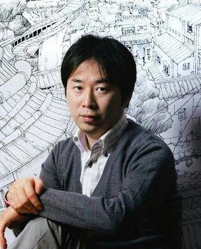

# La historia de Sasuke: Amanecer (Novelas de Naruto)

  

## 🔖 Tabla de contenidos

- [x] [NarutoPedia](./es_characters.md)
- [x] [Prologo](./es_prologue.md)
- [x] [Capitulo 1: Nubes oscuras que aparecen en un mundo de cambios](./es_chapter_1.md)
- [ ] Capitulo 2: La sombra del pasado revivida por un rayo
- [ ] Capitulo 3: Ostentosa bienvenida, rugido de dolor
- [ ] Capitulo 4: Donde los ojos rojos miran
- [ ] Epílogo

> [Versiones de idiomas](../../README.md#language-versions)

## 📖 Resumen

> La Gran Guerra Ninja ha terminado, pero para desentrañar el misterio que queda, Sasuke emprende un viaje que espera le permita expiar sus pecados. Durante su viaje, los ninja fieles al vengador Sasuke provocan una tragedia. Mientras tanto, el peligro se acerca a las aldeas de Konoha, Kiri y Kumo, donde los ojos rojos arden de odio. ¿Cuál es el futuro que contempla Sasuke?

## ✍️ Biografía del autor

  

El autor/artista **Masashi Kishimoto** nació en 1974 en la prefectura rural de Okayama, Japón. Al igual que muchos niños, su primera inspiración para convertirse en dibujante de manga fue en la escuela primaria, cuando leyó Dragon Ball. Tras pasar por la escuela de arte, ganó el premio Hop Step para nuevos artistas de manga con su historia Karakuri. Después de considerar varios géneros para su siguiente proyecto, Kishimoto se decidió por una historia impregnada de la cultura tradicional japonesa. Su primera versión de Naruto, dibujada en 1997, era una historia de una sola entrega sobre los espíritus del zorro; su versión final, que debutó en la Weekly Shonen Jump en 1999, se convirtió rápidamente en el manga ninja más popular del mundo. La serie también daría lugar a múltiples series de anime, películas, novelas, videojuegos y mucho más. Tras concluir la serie a finales de 2014, Masashi Kishimoto se ha mantenido ocupado este año con la historia secundaria Naruto: El Séptimo Hokage y la Primavera Escarlata y escribiendo la historia de la última película de Naruto, Boruto: Naruto the Movie, ambas centradas en el hijo del personaje principal, Boruto.