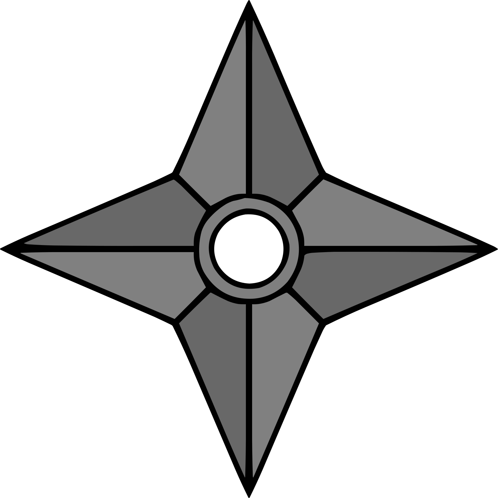

> [Tabla de contenidos](./es.md#-tabla-de-contenidos)

 

# Capitulo 1
## Nubes oscuras que aparecen en un mundo de cambios

1.

"Dale también mis saludos al Lord Raikage". 
El vasto océano estaba cubierto por una niebla blanca. No era especialmente buena para la visibilidad, pero las mujeres estaban acostumbradas a la niebla; veían bastante bien, incluso en estas condiciones. 
Encerrada por los cuatro costados por el océano, La Tierra del Agua, una de las tierras conocidas como las cinco grandes naciones ninja, era también el hogar de la aldea de Kirigakure. Los días en que Kirigakure era conocida como la Aldea de la Niebla Sangrienta y el origen de Akatsuki quedaron en un pasado lejano. Yagura, el Cuarto Mizukage, se había ensuciado las manos con todo tipo de maldades, pero el genjutsu que se le había aplicado había sido liberado por el Byakugan del difunto Ao, y con la asunción del cargo de Quinto Mizukage por parte de Terumi Mei, la situación en Kirigakure mejoraba constantemente. 
Y entonces, la Cuarta Gran Guerra Ninja cambió el mundo por completo. Las cinco grandes tierras ninja, en constante disputa, habían unido sus manos y superado juntas las terribles batallas, convirtiéndose en camaradas de guerra. Incluso después de la Gran Guerra, habían trabajado juntos para superar las dificultades que surgieron para el bien del mundo. Muchas vidas habían sido sacrificadas en la guerra, y los que sobrevivieron vivieron con gran tristeza, pero las cosas ganadas también fueron grandes. 
"¡Por favor, sean minuciosos en sus deberes en el entrenamiento conjunto entre Kirigakure y Kumogakure!" Chojuro —portando la gran espada gemela Hiramekarei que era la prueba de que era uno de los Siete Espadachines Ninja— llamó a los ninjas que se preparaban para zarpar. 
El oleaje golpeaba el puerto. Un barco lo suficientemente grande como para transportar a un centenar de personas estaba amarrado allí, en este lugar crítico para la Tierra del Agua, rodeado por el mar como estaba el país. 
Algunas personas se han quejado de la decisión de entrenar junto con otro pueblo, pero el sentimiento de amistad era bastante fuerte. El hecho de que tuvieran intercambios así con otras tierras se debía en gran parte a Uzumaki Naruto y a las muchas cosas increíbles que había logrado durante la Cuarta Gran Guerra Ninja. Su esperanza era que los ninjas se unieran para crear un mundo sin guerras. 
"Este tipo de experiencias también serán buenas para el futuro de Kirigakure", comentó la Mizukage al jefe de escuadrón a cargo del grupo de entrenamiento conjunto. 
"¡Sí, señora! Seremos audaces. Hecho para esta misión, ¡construiremos una base para la amistad con otras naciones!" El jefe de escuadrón respondió con sinceridad a esta esperanza de la Mizukage. 
Pero ella reaccionó con un grito ahogado. <em>¡¿Vieja solterona?!</em> 
Ignorando por completo el estado de alteración de la Mizukage, Chojuro le dijo al jefe de escuadrón: "El Lord Raikage es duro con él mismo y con los demás a veces. Pero es un hombre firme y valiente. Lo da todo en todo lo que hace. Además, en esta época del año, suelen llegar potentes tifones desde las islas vecinas al País del Agua, así que, por favor, no os precipitéis. Esté atento a ellos". 
"¡Ja, ja! ¿Así que ahora te preocupas por los demás, hm, Chojuro? Es mejor que te dediques a pastorear gatos". 
<em>Vieja solterona, dura consigo misma y con los demás a veces... ¡¿Deshacerse de ella?!</em> 
Mientras Chojuro y los demás charlaban alegremente, la mirada de la Mizukage se volvió sombría, y un aura ominosa se levantó a su alrededor. 
Al notar su silencio, Chojuro ladeó la cabeza con curiosidad y la miró. "Señora Mizukage, ¿le ocurre algo?". 
Ella exhaló una larga bocanada de aire y se recompuso de sus nervios dispersos.
"Acabo de recordar cosas con Ao... Si él estuviera aquí..." 
"Oh, Ao... Ojalá pudiera verme ahora también". Al parecer, Chojuro había interpretado su declaración como que quería presumir ante Ao del Chojuro ya crecido. 
En lugar de corregirle, la Mizukage sonrió y acercó sus conversaciones con un "Verdaderamente". 
"¡Muy bien, entonces! ¡Partimos!" llamó un ninja del barco, ahora que todos los miembros estaban a bordo; el barco abandonó lentamente el puerto. 
"Las cinco grandes naciones se odiaban tanto, y ahora podemos unirnos así", murmuró Chojuro profundamente emocionado, mientras lo veían alejarse entre la niebla del mar. "Es simplemente increíble, ¿verdad?". 
"Sí, realmente lo es". La Mizukage sintió algo más que esto, que cómo Chojuro dejó la transformación de este mundo cambiante a su manera. Ella era una de las shinobi que había vivido los días oscuros de Kirigakure. Había luchado, empapada en la sangre de los demás, en su propia sangre, por el bien de la aldea. 
En aquella época, si se determinaba que un ninja era una carga, simplemente se le echaba a los lobos. En efecto, había sido una época en la que se sospechaba de todo, en la que se había perdido de vista para qué se vivía, en qué se creía, como si se hubiera estado en una espesa niebla. De ese ambiente habían surgido, entre otros, Momochi Zabuza, temido como un demonio; Haku, del clan Yuki, jugado por el triste destino del kekkei genkai; y Hoshigaki Kisame, que cargaba solo con la oscuridad de Kirigakure —los llamados ninjas "malvados". Sin embargo, como ninja de la misma aldea, de la misma época, la Mizukage tenía en secreto sentimientos complicados al llamarlos malvados. 
Con la disminución de las tensiones entre las cinco grandes naciones y, por tanto, cada vez menos batallas, este mundo, antes centrado en la lucha, estaba cambiando desde sus cimientos.
Lo que significaba que tanto los ninjas como los ciudadanos medios también debían cambiar para adaptarse a estos nuevos tiempos. Pero no todos podían aceptarlo. Inevitablemente iba a haber gente que rechazara y despreciara la idea de este cambio, que intentara destruir este nuevo mundo. 
En su lucha por deshacer la herencia negativa dejada por la anterior Mizukage y la propia historia de Kirigakure, la actual Mizukage, Mei, se encontraba con todo tipo de dificultades, por lo que sabía. El cambio no era algo sencillo. 
El barco que se dirigía al País del Rayo se había convertido en una sombra en la distancia en un abrir y cerrar de ojos. La Mizukage forzó la vista para seguir la brumosa nave que desaparecía en la blanca niebla.

 

	

 

"Se ha nublado de repente". 
La ninja de Kirigakure que vigilaba en la cubierta del barco miró al cielo. Había pasado un día desde que el barco partió del puerto del País del Agua hacia el País del Rayo. Después de atravesar la niebla blanca, habían sido bendecidos con buen tiempo, pero de repente, empezaron a acumularse nubes negras sobre ellos. El viento sopló contra sus mejillas, y el rostro tranquilo del océano comenzó a cambiar. 
"Puede que se avecine una tormenta". La ninja vigilante dio un paso para ir a informar a la gente de dentro. Pero, de alguna manera, sintió que la miraban. Inconscientemente, se giró en esa dirección y vio una pequeña embarcación en el océano, en los descansos entre las olas. "¿Un barco de pesca?". 
A bordo de la embarcación había varias personas vestidas como pescadores con impermeables de paja y sombreros de 'amigasa' tejidos. Pero había muchas islas de todos los tamaños en esta zona, y no pocos de sus habitantes se ganaban la vida pescando. No había necesidad de preocuparse especialmente. O eso pensaba ella, pero el barco se dirigía poco a poco hacia ellos. 
"¡Oye! ¡Nos vas a golpear!", gritó en señal de advertencia, pero el barco no mostraba ningún signo de detenerse. "¡Oye!" La ninja de guardia se inclinó desde el barco, agarró su protector de frente con el escudo de Kirigakure y lo levantó. Tal vez se desprendía de ello un alarde de que eran ninjas de Kirigakure, una arrogancia inconsciente de que los pescadores como ellos no podían hacer nada al respecto. 
Una de las personas de la barca se levantó. Con el sombrero tejido profundamente sobre sus ojos. Los dedos agarrando el borde, levantándolo lentamente. La barbilla oculta, la boca, la nariz se revelaron, y entonces... 
En el momento en que vio los ojos, la ninja de guardia se cayó. 
"¡H—hey! ¡¿Qué pasa?!" Los ojos de los demás ninjas de la cubierta se abrieron de par en par al ver a su camarada caer repentinamente a la cubierta después de llamar a la pequeña embarcación que tenían delante. Pero antes de que ninguno de ellos pudiera correr a su lado, percibieron un aura anormal. 
"¡¿Qu-Quién está ahí?!" 
La misteriosa persona, con el rostro cubierto por el sombrero tejido, se posó sin hacer ruido, sola, en la cubierta del barco. Por su forma de comportarse, no había duda de que se trataba de un ninja. 
Al oír la conmoción, el jefe del escuadrón se acercó corriendo.
"¡Agárrenlos!" 
Los ninjas de Kirigakure empezaron a tejer señales para capturar y eliminar al intruso. Estaban en el agua; dado el número de usuarios del Estilo Agua en Kirigakure, deberían haber tenido la ventaja. 
Sin embargo, el intruso volvió a levantar tranquilamente el borde del sombrero. 
"¡¡Qué—!!" 
Jóvenes ninjas con un futuro prometedor, veteranos shinobi que habían vivido la época conocida como la Aldea de la Niebla Sangrienta y habían sobrevivido a la Cuarta Gran Guerra Ninja, todos ellos se derrumbaron en el acto, incapaces de hacer nada contra este único oponente ninja.

 

	

 

"Llegan tarde". 
Los ninjas de Kumogakure refunfuñaron, esperando bajo la llovizna para recibir a los ninjas de Kirigakure en el puerto del País de la Luz. La hora de llegada prevista había pasado hace tiempo, y no había llegado ningún mensaje que dijera que el barco llegaría tarde. 
"El Lord Raikage va a perder la cabeza si se retrasan demasiado". 
Su directo y corto Raikage. Si lo hacían esperar demasiado, estallaría en cólera; bien podría hacer caer el rayo de su nombre sobre ellos. 
"Tal vez el clima no esté funcionando con ellos. Al fin y al cabo, no hay ningún lugar en el océano donde resguardarse de la lluvia". 
"Pero al menos podrían enviar un halcón mensajero desde el barco, ¿no? También sería más fácil para nosotros informar a las alturas, si enviaran una pequeña nota diciendo que llegan tarde". 
"Es cierto, pero...". 
El viento rozaba las mejillas del ninja de Kumogakure, cada vez más mojado. Tras considerar de nuevo la posibilidad de que su llegada se retrasara aún más, decidieron enviar un mensajero a Kumogakure. 
"Eh, espera. ¿Es eso de ahí?". 
Por fin ha aparecido un barco en el horizonte. 
"Así que por fin aparecen, ¿eh?". 
El barco llevaba la marca de Kirigakure; era claramente el que estaban esperando. 
"Está muy tranquilo, ¿eh?". 
No había nadie en la cubierta; no podían ver a ningún ninja de Kirigakure. Tal vez se habían metido en el camarote para evitar la lluvia. 
A medida que el barco se acercaba, el viento y la lluvia se hacían más intensos. Casi como si trajera algo siniestro. 
"¡Bienvenidos a la Tierra del Rayo!", gritó el representante de Kumogakure, cuando el barco llegó a la orilla. 
No hubo respuesta desde el interior. Pensando que esto era sospechoso, los ninjas de Kumogakure se miraron entre sí. 
"¡Bienvenidos!", gritó de nuevo, con la voz tensa. 
Finalmente, alguien apareció desde el interior del barco. Un ninja que llevaba un sombrero tejido. Este ninja miró al representante que había llamado para dar la bienvenida al barco. 
"...Oh..." El representante se tambaleó y luego se desplomó sobre el puerto resbaladizo por la lluvia. 
"¡¿Qu-Qué ocurre?!". 
Los ninjas de Kumogakure estaban desconcertados por este repentino acontecimiento. 
El ninja del sombrero bajó de un salto del barco y arrojó el sombrero, revelando lo que había estado oculto bajo él. 
"¡¿Es-Esos ojos?!" 
Los ojos carmesí brillaban inquietantemente bajo la lluvia. Ni uno solo de los ninjas de Kumogakure se libró de quedar atrapado por su mirada. 
"Mierda, jutsu ocular..." 
Nada más ver ese brillo rojo, los ninjas de Kumogakure perdieron todas sus fuerzas y cayeron al suelo. 
"Eso fue maravilloso". Los compañeros de Ojos Rojos bajaron de un salto de la nave tras ver cómo se desarrollaba la escena. 
"Metedlos en la nave", ordenó Ojos Rojos, y los demás ninjas asintieron. 
Los ninjas de Kirigakure ya estaban dentro del barco, gordos de espaldas, sin mover ni un músculo. 
Mientras los demás arrastraban a los shinobi de Kumogakure, Ojos Rojos recogió el sombrero tejido y se lo volvió a poner. El tiempo se volvía cada vez más duro, y las nubes negras, agitadas por el viento, se retorcían como una serpiente gigante. 
"¡Los tenemos a todos!", gritó un ninja, y Ojos Rojos saltó de nuevo al barco. 
Un rayo atravesó un cielo que retumbaba con truenos. 
"Lo teñiremos todo de rojo". 
<em>No permitiré esta paz.</em>

2.

El bosque era espeso. La hiedra se enroscaba alrededor de los gruesos troncos, hasta las raíces de los árboles musgosos, borrando la frontera entre el árbol y la tierra. Este árbol en particular, que extendía sus ramas hacia el cielo, buscando la luz del sol, tenía cientos de años. Pero más allá había jóvenes brotes que aún no habían crecido. 
Alguien miraba todo desde arriba. El ojo izquierdo, que apenas asomaba entre el pelo que colgaba de su cara, era el Rinnegan supremo. A primera vista, el derecho parecía un ojo normal, pero albergaba el Sharingan, el kekkei genkai del clan Uchiha. El nombre del hombre era Uchiha Sasuke. 
En la cima del enorme árbol, Sasuke contemplaba la vista en todas las direcciones. Había superado la Cuarta Gran Guerra Ninja y había vuelto a ser un shinobi de Konoha.
Sin embargo, en lugar de quedarse en la aldea, había emprendido un viaje. 
<em>Quiero saber cómo es este mundo ninja, —cómo me parece el mundo ahora.</em> 
Había estado viajando durante varios años, y había visto cosas que probablemente no habría notado cuando estaba sumido en la oscuridad. También había habido momentos en los que recordaba con dulzura el pasado del que había intentado liberarse. Hubo momentos en los que recordó a sus amigos. Vio con sus propios ojos las cicatrices de la guerra; tocó la tristeza de la gente, y sintió la inutilidad de la venganza. 
En el pasado, Sasuke había soportado el dolor y el sufrimiento de que le arrebataran su familia y su clan con la poderosa medicina de la venganza. Pero en la profundidad de esa oscuridad, se había confundido sobre el camino a seguir. Había perdido de vista lo que era importante. Había tardado mucho tiempo en ser capaz de entender y aceptar eso, pero Sasuke lo sentía realmente ahora. 
También sintió los cambios en el mundo. Los cinco Kage habían actuado para hacer desaparecer las grandes guerras y mantener la paz y el orden. Antes, el poder de los ninja se utilizaba para proteger a sus propios países, y para invadir y atacar a otras naciones. Ahora, se utilizaba para desarrollar equipos que no requerían chakra para transmitir información al instante, para mantener instalaciones médicas, para comunicarse activamente con otras naciones y para mejorar los sistemas de distribución, entre otras cosas. El mundo estaba entrando en una nueva era de crecimiento. 
Por eso no podía pasar por alto un asunto en particular. 
<em>Otsutsuki Kaguya.</em> 
La mujer que había tomado en su boca el fruto del Árbol Divino —que se decía prohibido— ganó chakra, y trajo la calma a un mundo turbulento. Pero había sido consumida por el inmenso poder, y tras un tiempo en el que se desbocó, sus propios hijos, Hamura y Hagoromo, la habían sellado. 
La mismísima Kaguya había vuelto a este mundo, y Sasuke, junto con sus compañeros del Equipo 7 y Uchiha Obito, la había sellado una vez más. Una vez que la amenaza que había sacudido al mundo había pasado, la gente se regocijó, pero algo en ello molestó a Sasuke. 
Gracias a las maniobras secretas de Zetsu Negro para traerla de vuelta, Kaguya vinculó a las personas sobre las que lanzó el Tsukuyomi Infinito a las raíces del Árbol Divino, transformándolas durante muchos años en sus soldados personales. El resultado final fue el ejército de Zetsu Blanco. 
Anteriormente conocida como la Diosa Conejo, Kaguya cambió de alguna manera después de haber liberado al mundo del conflicto, por lo que la gente conectada al Árbol Divino también vino después de la paz que ella trajo. ¿Por qué, en un mundo en el que se suponía que la lucha había terminado, había necesidad de utilizar el Tsukuyomi Infinito en la gente y convertirla en soldados? Para jugar cruelmente con los que tenían poder, para controlar a los seres humanos con el miedo; se le ocurrieron varias razones, pero Sasuke no veía una respuesta clara. 
Perseguía los rastros que había dejado Kaguya para despejar sus dudas, pero su oponente era el progenitor del chakra. Puede que Sasuke tuviera el Rinnegan, pero seguir su rastro no era nada fácil. 
"¿Mm?" Sintiendo un aura, miró hacia el suroeste.
Cuando entrecerró los ojos, pudo ver algo que volaba en su dirección. A primera vista, era un pequeño pájaro que agitaba sus alas, pero en ese pájaro no circulaba sangre, sino tinta y texto que cobraba vida gracias al chakra. 
Sasuke sacó rápidamente un pergamino, y el pájaro voló hacia él como si le hubieran llamado. El Arte de la Imitación de Bestias de Konoha del ninja Sai.
La figura del pájaro desapareció, y en su lugar se extendió un texto en el pergamino abierto. 
Pensando que necesitaba tener una visión más diversa del mundo para conocer a Kaguya, Sasuke había empezado recientemente a comunicarse deliberadamente con Konoha con más frecuencia, pidiéndoles que le enviaran información sobre el estado de la aldea y del mundo. 
Dirigió su mirada a las palabras de la página, pensando que se trataba de una de esas misivas, pero su ceño se frunció ante el contenido.
"Esto..." 
Era un mensaje del actual Hokage, Hatake Kakashi.
Al parecer, un gran número de ninjas de Kirigakure y Kumogakure ha desaparecido repentinamente. No había señales de lucha, y la información era limitada, por lo que el Hokage le pedía que se pusiera en contacto con Konoha si encontraba algo sospechoso que pudiera estar relacionado con el incidente. 
"¿Más de un centenar de ninjas desaparecen de repente?" 
Si había una persona detrás, era posible que fuera un usuario de genjutsu. En ese caso, lo mejor sería que Sasuke, con su jutsu ocular superior, respondiera. Si usaba el Sharingan, podría ser capaz de ver lo que otros ninjas no podían. 
En la cima del árbol al que se había subido para comprobar su dirección, Sasuke miró una vez más a su alrededor con esos ojos. Varias nubes de humo blanco se elevaban en el aire más allá del bosque en el que estaba encaramado. Sin embargo, no era de los incendios. Era vapor. Estaba así de cerca de Yugakure, una aldea en la que brotaban manantiales de agua caliente de la tierra, a menudo utilizados como balneario. Estaba en la Tierra del Vapor, que no estaba lejos de la Tierra del Rayo, y los barcos siempre partían de allí hacia la Tierra del Agua. 
"Tal vez me dirija a la Tierra del Rayo, entonces". Dado que podía llegar a ella por una ruta terrestre, Sasuke puso primero su mirada en el País del Rayo, y se dejó caer en el bosque.

 

	

 

Hasta que, en torno a la puesta de sol, Sasuke avanzó en silencio, sin descansar, corriendo a través de un matorral de bambú. Era difícil saltar a través del flexible y elástico bambú como lo hacía con los árboles. Mientras se movía por un terreno plagado de hojas de bambú para salir rápidamente de la arboleda, Sasuke pensó en la situación. 
Todavía estaba en el País del Vapor. Quería estar en la vecina Tierra de la Escarcha para cuando cambiara la fecha, y luego en la Tierra del Rayo y la aldea de Kumogakure al día siguiente. 
De repente, un pequeño asentamiento apareció en su campo de visión. Era el tipo de aldea rural que se vería en cualquier lugar, pero inconscientemente se detuvo. 
No había ni una sola luz en el pueblo. 
Aunque el sol se había puesto, era demasiado pronto para que todos se hubieran ido a dormir. Además, acababa de enterarse de la desaparición de un gran número de ninjas. 
Sasuke cerró los ojos un momento y concentró su poder en el ojo derecho. Cuando abrió los párpados, el ojo se tiñó de rojo, con tres marcas 'tomoe' visibles en él. Saringan. 
Miró la aldea con ese ojo. En efecto, había gente dentro de las casas, que aprovechaban ampliamente el bambú circundante en su construcción. Pero todos ellos estaban como conteniendo la respiración. Casi como si tuvieran miedo de algo. 
Con la curiosidad despertada, Sasuke dio un paso hacia la aldea. 
"¡Así que te muestras! ¡Has caído Trueno Oscuro!"
Alguien saltó con mucha fuerza de debajo de las hojas de bambú. 
Sasuke miró en esa dirección para encontrar a un anciano calvo, todo piel y huesos, que cargaba contra él, con una lanza de bambú en la mano. Sus movimientos no eran rápidos, y no era fuerte; parecía ser una persona normal sin ninguna relación con las artes ninja. 
Sasuke saltó hacia atrás y esquivó ligeramente. Pero en el lugar donde aterrizó, sintió chakra detrás de él. 
"Liberación de agua: ¡Barrera de lluvia!" La voz aguda de una joven sonó, y un sinnúmero de pequeñas bolitas de agua, como el azúcar glas de un pastel dulce, volaron hacia él. 
Sasuke hizo señales, tomó aire y se llevó un dedo a la boca. <em>"Estilo Fuego: ¡Técnica de la Gran Bola de Fuego!"</em> 
El Estilo Fuego era la especialidad de los Uchihas. Las llamas que liberó envolvieron las bolitas de agua de su oponente, evaporándolas al instante. 
"¡¿Qué?! ¡¿El Estilo Agua puede ser hecho por el Estilo Fuego?!" gritó su oponente, al ver que su propia técnica desaparecía sin llegar a tocar a Sasuke. Miró hacia allí y vio a una chica bajita con cara de niña de pie. 
"¡Chino, vuelve!" Ahora apareció un hombre musculoso, como para empujar a la niña "Chino" hacia atrás. Con el kunai preparado, se lo lanzó a Sasuke, con la punta apuntando directamente a su corazón. 
Se clavó en el bambú detrás de él. <em>¡Rrrrrip!</em> La hierba de gran tamaño explotó hacia atrás. 
"El viento está cambiando la naturaleza, ¿no?" Sasuke observó. El kunai, envuelto en chakra de viento, había expandido el aire dentro del nodo del bambú y lo había roto. 
"¡Eh! Jóvenes, ¡¿en qué andáis?! Date prisa y derríbalo!", gritó el anciano. 
"¡¿Qué?! ¡Nadie me dijo que era tan fuerte!" Chino frunció el ceño y miró fijamente a Sasuke. Y entonces jadeó y le señaló el ojo. "¡No! ¡De ninguna manera! ¡Mira, Nowaki! Ese ojo... ¡el Saringan!" 
Una mirada de sorpresa se levantó en el rostro del hombre grande, quien aparentemente era Nowaki. "¿Es eso real?" 
¡Escuchad, mocosos sin carácter! Si os ponéis así, ¡lo haré yo! ¡Trueno Oscuro, me vengaré de mi hija!" Agarrando su lanza de bambú, el anciano cargó una vez más. 
Sasuke no tuvo la oportunidad de preguntar siquiera qué estaba pasando; en cualquier caso, no tenía otra opción. "¡Hah!" Exhaló un fuerte aliento, y tomó su espada en la mano. 
"¡Muereeeeeee!" El anciano empujó la lanza de bambú hacia delante. 
Sasuke cortó fácilmente el extremo de la misma. Con una velocidad increíble, cortó la lanza en finas rondas hasta la mano del anciano, antes de llevar la punta de su espada hasta la tráquea del anciano. Sasuke presionó la hoja contra su garganta, como para que notara la sensación de frío de la espada. 
"Ee, eeep". El bambú, cortado en una sola articulación, cayó de la mano del anciano. Gotas de sudor aparecieron en su piel seca y cayeron al suelo. 
"¡Ah, ah e—espera, hermano! ¡Jefe! ¡Guapo! ¡Varonil! ¡No mates al viejo!" Presa del pánico, Chino se acercó a Sasuke como para calmarlo. 
Al no responder a esto, Sasuke le dijo al viejo: "Tienes una idea equivocada". 
"Ja, ja...". 
"No conozco a este Trueno Oscuro". 
"Eee, eee..." Las palabras de Sasuke no parecían llegar a los oídos del anciano, que seguía respirando con dificultad, temblando de miedo.
Así no llegarían a ninguna parte. 
Sasuke alejó la hoja de su espada lo más mínimo de la garganta del anciano. "No soy Trueno Oscuro". 
"¿Qué?" 
"Es la primera vez que escucho ese nombre". Sasuke bajó su espada, y el anciano se derrumbó de rodillas en el acto. 
Mientras tanto, Chino y Nowaki se miraron. 
"¡Iou! ¡Dice que es un error!" gritó Chino. 
Pero el viejo de Iou gimió: "¡Cállate! ¡Este no es el momento para eso! Mi corazón, ¡ah! ¡Me dueeeele el corazón!" Liberado del terror a la muerte, el cuerpo de Iou respondió con intensas palpitaciones. Apretó una mano contra su pecho y aspiró aire desesperadamente. 
"Lo siento. Fue un terrible error el que cometimos".
A diferencia de Iou, Nowaki parecía sinceramente arrepentido. 
"Aunque siento que hubiéramos sido nosotros los que hubiéramos muerto si la lucha continuaba, lo siento", añadió Chino, dando una palmada con ambas manos en un gesto de contrición. "¡Vamos, Iou!".
¡Pide perdón tú también! 
Aún en el suelo, Iou volvió la cara. "¡Hmph! ¡La culpa es suya por venir a través de Takeno en un momento como éste!", maldijo. 
"¡Oooh, maldito viejo!" 
"¡¿Qué has dicho?!" Espoleado por las palabras de Chino, Iou trató de levantarse, pero rápidamente volvió a sentarse con fuerza. Al parecer, también se había echado la espalda. Golpeó el suelo con rabia. "¡Ngh! ¡Y yo que creía que hoy íbamos a arreglar las cosas con la banda del Trueno Oscuro!". 
"¿Exactamente qué es esa banda del Trueno Oscuro?" Iou había dicho que iba a vengarse de su hija. No había duda de que algo estaba pasando aquí. 
"Um, esa historia es larga. ...Iou, vamos a casa por ahora. Tenemos que explicarle las cosas al hombre de aquí". 
Como un niño obstinado, Iou volvió la cara. Chino refunfuñó un exasperado "Vamossssss", y luego le hizo una señal a Nowaki con los ojos. 
"Vamos a volver ahora, Iou". Nowaki levantó a Iou del suelo. 
"¡Hngh!", gritó el anciano. 
Nowaki comenzó a caminar hacia la aldea, y Chino la siguió, con las manos unidas detrás de la cabeza. Sasuke les miraba a la espalda; Chino le devolvía la mirada para instarle a seguir. "¡Deprisa!" 
"Esto parece que va a ser una molestia", murmuró Sasuke mientras se movía para seguir a los tres. Pero entonces sintió que le miraban y se giró. 
Sasuke observó la escena, pero sólo había el bosque de bambú que se extendía ante sus ojos. Estaba tranquilo, no había señales de ninguna bestia. 
"Hermano, ¿qué ocurre?" gritó Chino, preocupado. 
Sasuke observó la espesura de bambú una vez más antes de seguirla.

 

	

 

Lo llevaron a la casa de Iou. Al parecer, Iou era el alcalde de este Takeno, y su casa era notablemente grande. Dentro había todo tipo de artículos hechos de bambú, desde accesorios de uso cotidiano hasta juguetes para niños. 
"Así que, al parecer, Takeno vende estas artesanías de bambú para ganarse la vida". Chino le mostró a Sasuke las cestas de mimbre de bambú, los pinchos y las cañas de pescar, entre otros artículos que había a un lado. 
"¡No vayas a tocar las cosas!" Iou le arrebató un pincho con un gruñido, pero Chino no se inmutó lo más mínimo; cogió una libélula de bambú y la hizo volar por la habitación. Por desgracia, parecía que iba a aterrizar encima de la cabeza de Sasuke, pero la atrapó antes de que lo hiciera, y la sostuvo frente a él. 
"Supongo que venden todo esto en Yugakure. Allí hay muchos turistas", señaló Chino. "Pero los precios son muy bajos, así que apenas ganan nada con ellos". 
"¡Silencio, tú!" rugió Iou al instante. 
Yugakure era la rara aldea ninja que también era un destino turístico. Y a juzgar por las cestas apiladas y el gran número de pinchos en la zona de trabajo, parecía que sí había demanda de los artículos, pero al parecer la vida seguía siendo dura en esta aldea. 
"En realidad, Nowaki y yo actuamos en Yugakure un poco antes". 
"¿Actuar?" Sasuke enarcó una ceja. 
"Somos unos shinobis de poca monta, artistas ambulantes. Hicimos un poco de dinero en esa ciudad onsen. Allí sí que se puede limpiar en entretenimiento". Chino exhaló, y las burbujas de jabón aparecieron, una tras otra. Para un shinobi, no era un gran truco, pero probablemente fue bien recibido por la gente común.
"Entonces, nos dirigíamos a otra zona cuando pasamos por Takeno, ¿vale? Nos detuvimos en la tienda para comprar comida, y este anciano se aferró a nosotros. Nos rogó que le ayudáramos a vengarse, y luego lloró sobre nosotros". 
Por fin estaban entrando en materia. Como si estuviera obligado por la historia de Chino, Iou gritó: "¡Todo es por culpa de Trueno Oscuro! Son una organización malvada, desalmada y sin corazón. Vienen a por aldeas pequeñas y las saquean. Matan a la gente por deporte. Hace unos meses, vinieron a por el pueblo en el que se casó mi hija... ¡y mataron a todos!". 
Así que por eso hablaba de venganza. 
Tal vez recordando a su hija, las lágrimas brotaron en los ojos de Iou. "No fuimos bendecidos con hijos, y después de envejecer, por fin, ¡mi dulce niña! Se casó la primavera pasada. ¡Iba a tener un bebé pronto!". 
Aparentemente incapaz de expresar sus sentimientos con palabras, Iou apretó los dientes como si intentara contener las lágrimas. 
"Dijo que habían matado a su hija y que su mujer había enfermado por el impacto y había muerto", terminó Chino. 
La tragedia engendra la tragedia, y ahora sólo quedaba Iou. Era una situación terrible; no era de extrañar que se viera impulsado a la venganza. 
Habiendo escuchado en silencio hasta ahora, Nowaki miró con lástima a Iou. "Al parecer, la gente de esta zona teme a este Trueno Oscuro y vive su vida con temor. Mira las ventanas". 
Cuando Sasuke hizo lo que se le había ordenado, vio que de las ventanas colgaban cortinas opacas para que no se filtrara la luz. Los habitantes de las otras casas probablemente tenían la misma configuración. 
Así que por eso habían estado al acecho, e intentaron acabar con el grupo de Trueno Oscuro. 
"¡Ahora, tú! Eres fuerte, ¿verdad? ¡Por favor! ¡Ayúdame!" Iou se limpió toscamente los ojos con el dorso de la mano mientras pedía ayuda a Sasuke, casi lanzándose hacia delante. 
"¿Qué? ¿No es eso demasiado egoísta?" Chino sonaba exasperado. 
"¡Cállate!" Le rugió Iou, y siguió sin pausa. "¡Me disculpo por lo de antes!" Bajó la cabeza en una profunda reverencia, y luego no se movió para volver a subirla. ¿Pensaba seguir haciendo la reverencia hasta que Sasuke dijera que sí? 
Incapaz de quedarse de brazos cruzados, Nowaki bajó la voz y dijo: "No estoy con Iou ni nada por el estilo, pero, al parecer, el líder de este grupo del Trueno Oscuro está diciendo que su maestro es Uchiha Sasuke. Y lo está transmitiendo al mundo". 
"¿Qué ha dicho?" Sasuke arrugó inconscientemente la frente ante la repentina aparición de su propio nombre en la conversación. 
"Eres tú, ¿verdad? Uchiha Sasuke. Supongo que realmente te admira o algo así". 
A diferencia de Iou, Chino y Nowaki entendían de ninjas. Y eran artistas ambulantes. Tenían información mientras viajaban por el mundo. Precisamente por eso, habían adivinado enseguida quién era, una vez que vieron su Sharingan. 
Sasuke nunca había oído que nadie se llamara Trueno Oscuro. Naturalmente, le molestaba que alguien utilizara su nombre como le viniera en gana, pero más que eso, el hecho de que la gente que hacía el mal en el mundo lo respetara abiertamente, disparó una sombra de pesadumbre en su corazón. La sombra era oscura y pesada. 
"Eso es todo, entonces", murmuró Sasuke, lentamente. Ahora que su nombre había salido a relucir, no podía decir que no tenía nada que ver con él. 
Y era un hecho que el grupo del Trueno Oscuro era violento, con muchas víctimas, y esta aldea estaba expuesta a ese terror.
La desaparición de un gran número de ninjas también le preocupaba, pero no podía alejarse exactamente de esta aldea. La razón por la que Sasuke estaba en este viaje era también para expiar al mundo, después de todo. 
"¿Eh? ¿Vas a ayudar?" Al parecer, Chino no creía que Sasuke fuera a ayudarles. Lo miró con los ojos muy abiertos. "Me imaginé que dirías 'no es mi problema', o 'arregladlo vosotros mismos', y luego darías la vuelta a la mesa antes de irte". 
En primer lugar, él nunca voltearía una mesa, pero el antiguo Sasuke probablemente sí habría dicho eso. Para empezar, el antiguo él habría pasado rápidamente por esta aldea, y se habría dirigido directamente al País del Rayo. 
"¡Así que lo harás! ¡Eres el hombre que creí que eras!" Iou levantó la cabeza y una amplia sonrisa se dibujó en su rostro. El cambio en su actitud fue un latigazo. 
Ver a Iou así me hizo recordar a otra persona. Tazuna, el constructor de puentes del País de las Olas. Tazuna había luchado contra varios obstáculos para construir su puente, y tenía la misma audacia y actitud de cambio rápido. Quizá fuera una característica especial de esta generación. 
Pero los caminos que los dos hombres habían recorrido eran exactamente opuestos. Incluso después de que su ser querido hubiera sido asesinado, Tazuna arriesgó su vida para luchar por el futuro de la tierra, mientras que Iou se dejó llevar por el odio para ver el poder de la venganza. 
"En cualquier caso, es suficiente por hoy, ¿no? No parece que el Grupo del Trueno Oscuro vaya a aparecer. Descansemos". Chino hizo un alarde de bostezar enormemente. 
"Ya lo creo. Aquí hay habitaciones. Usadlas si queréis. ...Y si vienen, cuento con vosotros", dijo Iou, como para dejar claro el punto. Sus ojos mostraban que estaba seguro de que esta aldea iba a ser atacada. Y en el fondo de esos ojos había una oscuridad que buscaba el castigo para Trueno Oscuro por haber matado a su hija. 
Aunque Sasuke ayudara a resolver este incidente, no tenía intención de echar una mano a la venganza. Aunque probablemente Iou no aceptaría eso. En lugar de responder al anciano, Sasuke se dirigió a la habitación que le habían asignado.

 

	

 

"¿Eh? Dígalo una vez más". 
Una pequeña aldea anida en las montañas. Pero ya no había aldeanos en ella. Casas destruidas, gente cruelmente obligada a exhalar su último aliento. Sólo las bestias que captaban el olor de la sangre estaban vivas. 
En el interior de una casa en ruinas, el hombre que se sentaba en la mesa y lanzaba una pelota contra la pared levantó las comisuras de la boca ante las palabras de su subordinado. Pelo morado azulado atado con soltura, labios pálidos. Sólo sus ojos brillaban y resplandecían. 
"¡Sí, señor! No mucho después de la puesta de sol, cuando fuimos a explorar Takeno, ¡había un hombre usando el Sharingan! Señor Karyu, lo más probable es que fuera ¡Uchiha Sasuke!". 
La bola golpeó la pared y rebotó en el suelo empapado de sangre junto a un cadáver, y luego volvió a la mano del hombre —de Karyu—. 
"Uchiha Sasuke. El único superviviente del orgulloso clan Uchiha. Así que está en Takeno..." Karyu rió suavemente y bajó de un salto de la mesa antes de lanzar la pelota contra la pared una vez más. 
<em>¡Thuk!</em> Hubo una fuerte explosión, y el subordinado se tapó involuntariamente los oídos y cerró los ojos. Cuando los abrió de nuevo, había un gran agujero en la pared, y Karyu lo había atravesado y había salido al exterior. 
Mirando a la luna oculta entre las nubes, Karyu extendió las manos. "El maestro de mi corazón, el hombre que mostró al mundo la maravilla del kekkei genkai, Uchiha Sasuke... ¡que tuviera la oportunidad de matarlo!" Una expresión de deleite apareció en su rostro, y gritó a sus subordinados en espera: "¡Todos, a trabajar! El momento justo para Takeno... ¡hacedlo pedazos!"

3.

Las enormes puertas de A-un que conectaban la aldea con el mundo exterior estaban ahora cerradas, como si quisieran huir de la oscuridad de la noche; el enorme muro de roca con los rostros de las seis generaciones de Hokage tallados en él estaba silenciosamente iluminado por la luz de la luna que se colaba entre las nubes. 
Antigua incluso entre las aldeas ninja, la Tierra del Fuego es Konohagakure. Esta aldea, que en su día sufrió daños catastróficos a causa de Pain de Akatsuki, ahora brillaba aún más que en el pasado, y la población, que descendió durante la Cuarta Gran Guerra Ninja, se estaba recuperando poco a poco.
Todo parecía ir bien, pero cada época tenía inevitablemente sus pruebas. 
"Hmm. Esto es realmente difícil" 
La oficina del Hokage. 
Mirando las cartas que habían llegado de Kirigakure y Kumogakure, el sexto Hokage, Kakashi, suspiró. Los shinobi desaparecidos eran manos maestras. Y con los ninja de Kirigakure, un centenar de shinobi habían desaparecido de golpe, junto con un barco. 
Según Kumogakure, alguien que había visto el barco de Kirigakure en el océano, cerca del puerto del País del Rayo. En cuyo caso, era posible que el barco hubiera atracado en algún momento en el puerto del País del Rayo. ¿Así que tal vez los ninjas de Kumogakure habían subido al barco y se habían ido con ellos a algún lugar? 
Pero no iba a servir de nada si realmente habían huido a través del océano. No dejarían ninguna huella ni olor; en el ancho océano, incluso los perros ninja que Kakashi podía convocar, todos ellos excelentes rastreadores, tendrían dificultades para encontrar a los ninjas desaparecidos. Sin duda, Kirigakure y Kumogakure no sabían qué hacer. 
Si esto fuera el pasado, los detalles de este incidente se habrían detenido en las fronteras, pero las cartas en busca de información se habían enviado a Konohagakure, Iwagakure y Sunagakure —aldeas ninja de las cinco grandes tierras— y ahora la información parecía extenderse aún más. Aunque se trataba de un problema de otra aldea, no era un problema ajeno. 
Cuando llegó la información, Kakashi la transmitió inmediatamente a los ninjas de Konoha. Y a Sasuke, que estaba viajando por el mundo. Kakashi sospechaba que el genjutsu estaba involucrado.
Aunque ni Kumogakure ni Kirigakure tenían teorías específicas, probablemente pensaban lo mismo. Y tenía que ser un genjutsu desconocido. Esa era la única conclusión a la que podía llegar cuando pensaba en el hecho de que tantos ninjas habían sido incapaces de enfrentarse a él. Probablemente Sasuke pensó lo mismo después de leer la carta de Kakashi. 
Sasuke había partido en su viaje de información y expiación, diciendo que algo le molestaba. A diferencia de los ninjas de la aldea, él tenía cierto margen de maniobra. Y más que nada, tenía el Sharingan y el Rinnegan. Cosas que otros ninjas no podían saber podrían ser vistas con sus ojos. 
"Sexto". 
Oyó que llamaban a la puerta de su despacho. Al identificar la voz como la de Shizune, antigua alumna de la Hokage Tsunade, gritó: "Sí, pase". Ella tuvo la amabilidad de ser también su asistente. 
La puerta estaba ligeramente entreabierta; Shizune asomó la cara con una expresión de preocupación. "Disculpe, Sai dice que tiene un informe", le informó. 
Le había pedido a Sai que se pusiera en contacto con Sasuke. Así que probablemente era un informe de que su mensaje le había llegado. 
Shizune parecía preocupada, pero Kakashi dijo: "Claro, hazle pasar".
"Muy bien, entonces". Shizune abrió la puerta y miró por encima del hombro. "Disculpe". 
"¡Hola!" Sai entró con su habitual y algo engreída sonrisa en la cara. Detrás de él estaba Haruno Sakura, con cara de disculpa. Un signo de interrogación surgió en la mente de Kakashi. 
Detrás de Sakura, una persona más entró en la habitación. "¡Oye!" ¡Maestro Kakashi!" Haciendo el papel de tonto con una sonrisa alegre sin límites estaba el hombre que había salvado al mundo en la última Gran Guerra, Uzumaki Naruto. 
Sai era una cosa. ¿Por qué estaban Naruto y Sakura aquí? 
"Por supuesto que también serías tú". 
Naruto juntó las manos detrás de la cabeza y carcajeó. "Sai dijo que iba a venir a verte, así que me he unido". 
Sin el menor reparo. 
"¿Tú también, Sakura?" 
"Estaba buscando algo con Shizune". 
Así que cuando Sai y Naruto le pidieron a Shizune una reunión con el Hokage, se habían fijado en Sakura y la invitaron, entonces. 
"En fin. ¿Qué tal si escucho tu informe, Sai?" 
"Bien. Mi mensajero llegó a salvo a Sasuke el otro día". 
"El pájaro de la Bestia de los Dibujos animados voló hacia el noreste, ¿hm? En cuyo caso, a juzgar por el número de días, está cerca de Yugakure o Shimogakure, ¿quizás?" 
Al oír esto, Sakura dejó escapar un suspiro de alivio. Sasuke seguía vivo en alguna parte. Se sintió más tranquila, sólo con saber eso. 
"Entonces como, maestro Kakashi, ¿algún progreso en las desapariciones?" Naruto soltó las manos detrás de su cabeza y miró la carta en las manos de Kakashi. Era una época inteligente. 
"Aparentemente, no hay pruebas ni nada". 
"Sexto, hay algo que nos preocupa de este incidente", dijo Shizune. 
Sakura asintió y se adelantó. "Parece que también estamos viendo que faltan ninjas en Konoha". 
"¿Qué?" Kakashi comenzó a levantarse de su postura sentada. 
"No es a la misma escala que en Kirigakure o Kumogakure, pero hubo varios casos hace unos tres meses. También podría haber otros que simplemente no se hicieron públicos". 
Incluso ahora, tenían muchas misiones peligrosas, y a veces, los ninjas desaparecían. Y como tenían un contacto más frecuente que antes con otras regiones, había más gente entrando y saliendo. Así que esto no era una ocurrencia especial, rara —pero algo le molestaba a Kakashi al respecto, también. 
"¿Por qué estabas investigando algo así, Sakura?"
Sakura estaba muy ocupada como ninja médico, y el hecho de que estuviera investigando algo de esta naturaleza era un poco inesperado. Ante su pregunta, su mirada se congeló ligeramente. 
"Un habitual de la tienda de la familia de Ino se fue de viaje y desapareció. Ino dijo que no era el tipo de persona que desaparece de repente, y cuando me enteré de este caso, me acordé inmediatamente de él". 
Yamanaka Ino era una ninja femenina, rival y mejor amiga de Sakura. Su familia tenía una floristería, donde Ino también trabajaba de vez en cuando. La visión de Ino preocupada por un cliente habitual probablemente se había quedado grabada en la mente de Sakura. 
"Pensé en decírtelo una vez que supiera más detalles". 
Dado que se trataba de Sakura, no cabía duda de que había planeado decírselo una vez que hubiera investigado lo suficiente para estar segura. 
"Oh, gracias. Yo también le echaré un ojo". 
Aunque se creía que la persona de arriba tenía toda la información, en realidad no la tenía. Para bien o para mal, la gente tamizaba la información, decidiendo qué valía la pena contar al Hokage y qué no, por lo que mucha información nunca llegaba a sus oídos. Por eso era vital para él escuchar las opiniones de la gente que conocía así. 
<em>Menos mal que la historia de Sakura me llegó en el momento justo</em>, pensó Kakashi mientras dirigía su mirada a Naruto, quien había traído a Sakura para empezar. Fue en ese momento... 
"¡Sexto! Hay un invasor en la aldea!" Un ninja del equipo de barrera apareció de repente en el despacho del Hokage. La tensión recorrió la sala. 
"¿Han tocado la barrera?" 
Una barrera esférica había sido colocada alrededor de la aldea de Konohagakure, desde el suelo hasta el cielo. Después del ataque de Akatsuki, habían puesto una barrera aún más poderosa. 
"Ellos... ya están dentro de la barrera, hasta la puerta de A-un..." 
"¡¿Qué?!" 
"Los ninjas del equipo de la barrera están en este momento en su wa—"
El final de la palabra no salió. 
<em>¡Boom!</em> Oyeron un sonido como el de una explosión procedente de algún lugar. Kakashi y los demás abrieron las ventanas de su despacho y miraron al exterior. 
"Maestro Kakashi, llamas..." Un incendio se había desatado en la dirección que señalaba Sakura, cerca de las puertas de A-un, quizás un efecto de la explosión. 
"¡Maestro Kakashi! Iremos a comprobarlo ahora mismo!" Dijo Naruto. 
Sai abrió rápidamente un pergamino que colgaba de su cadera y envió su pincel a toda velocidad por él. La tinta dibujó un gran pájaro con las alas desplegadas. "¡Ninjutsu! Arte de la imitación de bestias de dibujos animados". 
El pájaro salió volando del pergamino como si hubiera nacido y extendió sus grandes alas fuera de la ventana. Agitándolas, el pájaro permitió primero que Sai saltara sobre ellas; luego, Naruto y Sakura siguieron su ejemplo. 
"Hazlo", dijo Kakashi, escuetamente. 
Naruto asintió, y los tres salieron volando en dirección a las llamas que lamían el aire. 
"¡Sexto, yo iré a dar la orden para las actividades de extinción de incendios!" 
dijo Shizune, y Kakashi asintió en su dirección antes de dar la orden de reunir información en todas las áreas. Miró las cartas de Kirigakure y Kumogakure que estaban sobre su escritorio. 
"¿Qué está pasando aquí exactamente...?"

 

	

 

A lomos del enorme pájaro de la Bestia de Caricatura que Sai había dibujado, Naruto y los demás se apresuraron en dirección a las puertas y al fuego cercano. Pero cuando estaban a mitad de camino, Sai chocó contra los tejados de los edificios. 
"¡Sai, qué está pasando!" Gritó Naruto sorprendido, cuando vio una célula de tres personas delante de ellos corriendo por los tejados hacia la puerta A-un. "¡Oh! ¿Shikamaru?" 
Sakura se inclinó hacia adelante y miró hacia abajo. "¡Ino y Choji también! Sai, ¡no puedo creer que te hayas fijado en ellos!" 
Al parecer, el grupo de Ino-Shika-Cho también había escuchado a Naruto y Sakura. 
"¿También se dirigen a la puerta A-un?" Gritó Shikamaru, mirando hacia atrás. 
"¡Sigue!" gritó Sai. 
Los tres saltaron al enorme pájaro, y aunque éste se tambaleó y estuvo a punto de estrellarse contra un edificio en el instante en que Choji estaba a bordo, Sai consiguió que volvieran a volar alto inmediatamente. 
Naruto y los demás miraron una vez más a los tres recién llegados. Shikamaru, Ino y Choji eran amigos de la infancia, y anteriormente se habían unido en una célula de tres personas a las órdenes de Sarutobi Asuma. Sin embargo, ahora cada uno tenía su propio puesto, y ya no solían trabajar en equipo. 
"Ino y su madre nos lo pidieron, así que hemos estado persiguiendo rastros del cliente habitual de la floristería", explicó Shikamaru, recordando a Naruto la investigación de Sakura y lo que le había informado a Kakashi. 
"¿Habéis encontrado alguna pista?", preguntó. 
"Encontramos la posada que probablemente fue el último lugar donde se hospedó", respondió Shikamaru. "La dueña de allí dijo que estaba de regreso a Konoha después de un tratamiento de aguas termales". 
Eso significaba que este cliente no había planeado desaparecer. 
"Entonces, algo pasó en su camino a casa", comentó Naruto. 
Ino asintió con firmeza. "Por cierto, se llama Tadaichi. Perdió a su esposa muy joven. Es el tipo de persona que compraba flores en nuestra tienda y se las ofrecía a su mujer siempre que tenía tiempo.
Solía ser activo en el Anbu, pero ahora está bastante entrado en años. Se retiró como ninja este año, y cuando vino a despedirse, nos dijo que iba a recorrer los lugares donde pasaba el tiempo con su mujer". Había sido un cliente habitual desde que Ino era pequeña, así que le tenía cariño, como era de esperar. 
"Mira. Está todo el asunto de Kiri y Kumo ahora mismo, ¿verdad? Nos preocupa que se haya visto arrastrado a todo eso", intervino Akimichi Choji. "También están investigando en Kumogakure, pero estaba lloviendo en ese momento, por lo que el olor se ha lavado.
Es difícil encontrar rastros de él". Choji estaba en contacto con Karui, una ninja de Kumogakure, por lo que podía obtener información independiente. 
"En cualquier caso, antes de todo eso, tenemos que hacer algo con esta situación", dijo Shikamaru, poniendo fin a aquella conversación. Miró hacia la puerta de A-un. Dentro de las puertas, que estaban cerradas por la noche, las llamas lamían el aire dentro de Konohagakure. 
"Shikamaru, acabamos de estar en casa del maestro Kakashi, y al parecer, hay un intruso en la aldea", le dijo Sakura.
"Se supone que los ninjas del equipo de la barrera ya están en camino hacia allí". 
"¿Entonces si logramos divisar al equipo de la barrera, conoceremos al enemigo?" Dijo Shikamaru, y Naruto se inclinó mucho hacia delante, forzando la vista. 
"¡Allí!" La mirada de Naruto se posó en el equipo de la barrera.
Parecían estar luchando contra el ninja enemigo. 
Shikamaru los vio al mismo tiempo. Arrugó la frente. "¿Qué? ¿Están totalmente a la defensiva?" 
Tal y como observó, los ninjas del equipo de la barrera estaban retrocediendo, casi como si trataran de evitar luchar de verdad.
Algunos ya estaban heridos, tirados en el camino. 
"¡¿Eh?!" Ino gritó de repente. 
"¿Qué pasa, Ino?" Preguntó Sakura, pero Ino no respondió, sino que se dirigió a saltar sola. 
"Ino, eso es peligroso". Sai la agarró del brazo para detenerla. 
Los ojos de Ino seguían mirando al enemigo que atacaba al equipo de la barrera. "No puede ser..." 
"¿Qué pasa, Ino?" preguntó Choji, al ver que toda la sangre se escurría de su rostro. 
Sus labios temblaban. "Tadaichi". Ella forzó el nombre. 
"¿Eh?" 
"Es Tadaichi" 
Un sobresalto recorrió el grupo. El hombre al que Ino llamaba Tadaichi estaba vestido con ropa de viaje, y la mirada de su rostro era inexpresiva, como si hubiera sido raspada. 
"¿Estás segura, Ino?" preguntó Shikamaru. 
"¡Estoy totalmente segura! ¡Pero no es el tipo de persona que se vuelve contra Konoha! Por qué..." 
"Entonces..." Shikamaru miró a Tadaichi, "¿Existe la posibilidad de que esté bajo un genjutsu... tal vez?" 
Esta vez, Sakura jadeó. Miró las caras de los otros enemigos. "Podría ser exactamente eso, Shikamaru". 
"¿Qué quieres decir?" 
La información que acababa de leer sobre los desaparecidos volvió a cobrar vida en su mente. "Es la gente que desapareció" 
"¡¿Qué?!" 
"¡Son ninjas de Konoha! Puede que todos lo sean!" 
Shikamaru chasqueó la lengua y miró a los ninjas del equipo de la barrera. "¡Así que por eso se han visto obligados a una batalla defensiva!" 
Probablemente alguien del equipo de la barrera se había dado cuenta de que los guerreros enemigos eran ninjas de Konoha. Pero si se trataba de un genjutsu, entonces existía la posibilidad de hacerlos volver en sí con un contragenjutsu. El equipo de la barrera estaba sin duda luchando con esa misma idea en mente. Los ataques que lanzaban a Tadaichi eran demasiado débiles para matarlo. 
"Espera, eso", dijo Naruto. "¿De qué se trata?" 
Sintieron una ola de presión, como si algo se hinchara y se acercara a ellos. 
Herido por el ataque del equipo de barrera, Tadaichi cayó al suelo, y su cuerpo comenzó a temblar. 
"¡Ah! ¡Esto es malo!" Naruto saltó inmediatamente del pájaro. 
<em>¡Clones de sombra!</em> Mientras tejía las señales en el aire, sus clones de sombra aterrizaron junto a los distintos miembros del equipo de barrera. 
"¡¿Naruto?!" 
"¡Estamos volando!" Sin darles la oportunidad de decir nada, Naruto levantó a los ninjas del equipo de la barrera, y todos partieron del lugar al mismo tiempo. 
Cuando miró hacia atrás, Tadaichi se estaba poniendo de pie lentamente. A pesar de estar herido, su rostro seguía inexpresivo. La sangre que salía de sus heridas espumaba y burbujeaba. Y eso no era todo. Aparecieron bultos por todo su cuerpo, casi como si hubiera otra criatura viva dentro de él, arrastrándose. 
"¡Tenemos que alejarnos más!" Naruto se alejó más de Tadaichi antes de dejar al ninja de la barrera en lo que probablemente era un lugar seguro, y luego comenzar a correr de vuelta a Tadaichi para tratar de ayudarlo. 
Pero los bultos que bullían en el cuerpo de Tadaichi se hincharon y crecieron, y su piel, incapaz de contener el crecimiento, se partió.
Y entonces... 
<em>¡Boom!</em> Explotó violentamente como si se abriera de par en par. Las casas más cercanas a él no pudieron resistir el impacto de la explosión y fueron destruidas. Afortunadamente, los clones sombra de Naruto habían ido a comprobar y sacar a la gente de los edificios cercanos, por lo que no hubo daños humanos, pero nuevas llamas se elevaron al cielo. 
"¡¿Estás bien, Naruto?!" gritó Sakura, mientras el pájaro imitador de dibujos animados de Sai aterrizaba y todos corrían al lado de Naruto. 
"Tadaichi..." Ino se quedó boquiabierta ante la escena, con trozos de carne tirados por todas partes. Sakura le puso una mano preocupada en la espalda. "Estoy bien". Se recompuso, e inmediatamente corrió hacia los miembros heridos del equipo de barrera con Sakura. 
Sin embargo, la amenaza no había terminado. 
"Oye, ¿no parecen un poco raros?" El rostro de Shikamaru se endureció mientras observaba a los ninjas de Konoha, probablemente bajo el control de alguien. Hasta hace unos momentos, habían estado enseñando los dientes a los miembros del equipo de la barrera, pero ahora, de repente, les daban la espalda y empezaban a correr. Los ninjas de Konoha extendieron entonces sus manos sobre el muro que rodeaba Konohagakure, y se aferraron a él. 
Naruto jadeó. "¡No puede ser! ¿Ellos también?" Miró fijamente sus cuerpos. Todos estaban heridos en alguna parte -probablemente heridas por la explosión de Tadaichi-. La sangre rezumaba de sus heridas, y al igual que antes, era espumosa. Un escalofrío recorrió la columna vertebral de Naruto: "¡Shikamaru! Van a explotar todos!" 
"¡¿Qué?! Si tenemos varias explosiones como esa al mismo tiempo, ¡toda esta zona podría salir volando!" 
Quedaban nueve ninjas de Konoha. Sus cuerpos empezaron a transformarse y a hincharse, como si las cosas de su interior estuvieran empujando hacia fuera. 
Shikamaru chasqueó la lengua. "¡¿Puedes hacer unas alas con el Arte de la Expansión?!", le gritó a Choji. 
"¡Ya lo tengo!" Choji abrió una bolsa de patatas fritas que llevaba escondidas y se las metió todas en la boca. Mientras las masticaba a toda prisa, concentró su poder en su cuerpo. "¡Aaaaaaaah!" 
La técnica secreta del clan Akimichi. En un abrir y cerrar de ojos, el cuerpo de Choji se volvió enorme, y en su espalda brotaron alas de mariposa. Esta técnica utilizaba una gran cantidad de chakra. Las mejillas de Choji, normalmente hinchadas, se esculpieron con un relieve muy marcado. 
"¡¿Cuánto falta para que exploten, Naruto?!" 
"¡Tal vez diez segundos!" 
Nueve, ocho, siete... 
"¡Lo tengo! ¡Todos, detrás de Choji! ¡Agarraos a algo sólido!" 
Seis, cinco, cuatro... 
"¡Choji, ahora! ¡Batea esas alas con todo lo que tienes!" 
"¡Aaah!" Habiendo captado rápidamente la intención de Shikamaru, Choji se preparó y batió las enormes alas de mariposa hechas con chakra. Envió todo su propio chakra al viento que crearon. 
Tres, dos, uno... 
<em>¡Boom!</em> El ruido de la explosión. Y una y otra vez. Una serie de ellas, y los cuerpos que se aferraban a la pared fueron arrancados de golpe. 
Shikamaru comprobó el frente, y luego gritó: "¡Aquí viene!" 
Cuando la onda de choque se acercó a la aldea de Konoha, chocó con el viento que irradiaba el enorme cuerpo de Choji. El viento chocó con la onda de choque, y los dos lucharon. 
"¡Te cubro la espalda!" Naruto gritó. "¡Aquí vamos, Kurama!" 
<em>¡Correcto!</em> 
Para reforzar el viento de Choji, Naruto invocó al Kurama de nueve colas, antes fuente de odio, ahora su compañero. El poder corrió por su cuerpo, generando una Liberación del Viento: Ransengan que envió volando hacia la onda de choque. Este nuevo viento hizo retroceder la onda de choque para proteger la aldea. 
"Muy bien. ¡Bien!" 
Después de luchar con el viento de Choji, la onda de choque fue rebotada más allá de la aldea con la fuerza añadida de la Liberación de Viento de Naruto: Ransengan. Los árboles del bosque justo fuera de las puertas fueron azotados por la combinación de viento y onda de choque y aplastados. 
"Hah, hah... Eso. Hacer. ¿El truco?" Choji soltó su jutsu, respirando con dificultad. 
Parte del muro que encerraba a Konoha estaba destruido, pero no parecía haber daños en la aldea. Las llamas que se alzaban en el interior de la aldea también habían sido apagadas. 
Shikamaru palmeó el hombro de Choji. "Buen trabajo". 
Sakura corrió hacia la pared rota, pero sus hombros cayeron con pesar. Los cuerpos se habían convertido en trozos de carne sin posibilidad de reparación. Ino también se mordió el labio. 
"En cualquier caso, tenemos que informar a la Hokage. Sai, perdona, ¿puedes llevarnos con tu mímica de dibujos animados?"
Shikamaru rápidamente dio instrucciones. Naruto también se movió para seguir a Shikamaru. 
"¡Naruto!" 
Justo cuando Sai sacó su pincel, escucharon que alguien gritaba repentinamente el nombre de Naruto. Miraron en esa dirección y vieron a un hombre con gafas de sol de montura ancha y pelo negro de punta recogido hacia atrás corriendo hacia la escena. 
"¿Eh? ¿Quién eres tú?" El hombre me resultaba familiar, pero no me salía su nombre. 
"¡Yamashiro Aoba!" 
"¿Yamashiro Aoba?" 
"¡Fuimos juntos a la Isla de la Tortuga en Kumogakure!" 
"¡Ohh! ¡Sí, claro! ¿Eh? ¿Qué? ¿Vas a la Isla de la Tortuga otra vez?" 
"¡Eso no! ¡Soy un mensajero del Hokage!" Aoba gritó el punto principal, intuyendo el peligro de que la conversación siguiera en este extraño círculo. 
"¿Del maestro Kakashi? ¿Qué dice?" 
"Hace un rato se detectaron intrusos por la barrera. Son treinta". 
"¡¿Qué?!" gritaron todos sorprendidos. Treinta -tres- veces el ataque de hace un momento. 
"¿Significa eso que hay nuevos intrusos?" Preguntó Sakura. "¿Los han detectado esta vez?" 
"Sí". Aoba asintió. "Ahora se dirigen hacia aquí". 
Naruto sintió los ojos sobre él desde el bosque al otro lado del muro destruido. "¡Allí!" 
Desde el oscuro bosque, primero, un hombre solitario. Le siguió uno más, y luego otro. 
"Eso puede ser..." Murmuró Sakura, con una mirada de desconcierto en su rostro. 
Llevaban uniformes ninja. Pero eran una mezcla de uniformes de Kirigakure y Kumogakure. Las marcas de esas dos aldeas también estaban grabadas en sus protectores de la frente. 
"Esto parece que va a ser un rollo", refunfuñó Shikamaru, que pensaba rápidamente. "Naruto, vosotros estabais con el sexto maestro Kakashi, ¿verdad? Oísteis que alguien había invadido la aldea y vinisteis corriendo al lugar. Por todo lo visto hasta ahora, supongo que el equipo de la barrera no se dio cuenta de los primeros intrusos hasta que estuvieron en la aldea". 
"S-sí". 
Shikamaru habló como si él mismo hubiera estado allí. "Aunque estaban siendo controlados por alguien, Tadaichi y los demás eran ninjas de Konoha. Por eso fueron capaces de atravesar la barrera sin ser notados. Probablemente sólo eran un señuelo, en el mejor de los casos". 
El cuerpo de ejército de ninjas con control mental se acercaba lentamente. Ojos apagados que no daban impresión de voluntad. Esta era la fuerza principal. 
"Además de eso, hay una buena posibilidad de que estos tipos que están aquí ahora sean los ninjas desaparecidos de Kiri y Kumo. Sinceramente, es una cosa tras otra". Shikamaru se rascó la cabeza. 
"Shikamaru -dijo- el desencadenante que los hace explotar es probablemente el haber sido heridos. Sus heridas emiten un extraño chakra y comienza la transformación de sus cuerpos". Al igual que Naruto se había dado cuenta de sus heridas, Sakura al parecer también había detectado el detonante de las explosiones. 
"En ese caso, no podemos descuidarnos con ellos". Una mirada seria se levantó en el rostro de Shikamaru mientras miraba fijamente a los ninjas que se acercaban. 
Y es que esta situación no sólo ocurría en Konoha.

 

	

 

"¿Por qué estarían aquí los ninjas del cuerpo de entrenamiento de la alianza?" 
A diferencia de Konoha, donde pocos de sus propios ninjas habían aparecido, a Kirigakure le habían lanzado varias docenas de los suyos desde el principio, y estos ninjas habían llegado al interior de la aldea. Luchando por defender las instalaciones clave de Kiri, Chojuro apretó los dientes ante el humo que se elevaba en todas direcciones. 
"Chojuro, la evacuación de los ancianos y los niños ha concluido", La Mizukage apareció ante él para informar del fin de la evacuación. "Me voy". Comenzó a correr hacia la zona central de la batalla. "Diles que me sigan. Tengo el deber de proteger a la gente de la aldea. Eso... significa ellos también". Miró el humo que se elevaba en mechones, a diferencia de la niebla que siempre se cernía sobre la aldea. Estas personas con control mental también eran ninjas de Kirigakure. 
"¡La protegeré, Lady Mizukage, a la aldea de Kirigakure... absolutamente!" 
"Mm, cuento con usted".

 

	

 

"¡Jefe! ¡Por favor, déjanos esto a nosotros! ¡Lo siento!" 
"¡Ngh!" 
Del mismo modo, los ninjas de Kumogakure también se quedaron mirando a sus compañeros completamente cambiados. El Raikage tenía ganas de unirse a la lucha, pero Darui, la mano derecha del Raikage, veía que se corría el riesgo de causar más daño si lo hacía, así que retenía al jefe de la aldea. 
"¡¿No deberíamos llamar a Killer B?!" Omoi sacó a relucir a su mentor Killer B, imaginando el peor de los escenarios. 
"¡Habrá demasiado caos!", gritaron todos los ninjas a su alrededor. 
"C, ¡¿no has detectado aún la verdadera identidad del enemigo?!" Darui dirigió su mirada al ninja sensor C. 
C frunció el ceño y movió la cabeza de un lado a otro.

 

	

 

Sus oponentes eran ninjas bajo un genjutsu. Y si les hacían daño, explotaban. No tenían voluntad propia. ¿Qué demonios se suponía que debían hacer? 
"¡Naruto!" 
Una nueva voz sonó. Se dio la vuelta y vio a una mujer que corría hacia él, con el pelo largo balanceándose. 
"¡¿Hinata?!" 
"Después de que te dieras cuenta de la explosión de Tadaichi y saltaras hacia atrás, la llamé a través de Ino", dijo Shikamaru al aturdido Naruto. 
Nacida en la familia principal del clan Hyuga, Hinata era la poseedora del Byakugan. Tenía un amplio campo de visión y la capacidad de ver a través de las cosas, entre otras cosas. 
"Hinata, parece que todos están bajo un genjutsu. ¿Hay alguien que los controla en alguna parte?" 
"Entendido. Voy a mirar". Hinata -ahora también esposa de Naruto- concentró su poder en sus ojos. Los vasos sanguíneos surgieron uno tras otro y entonces sus ojos se abrieron. 
<em>¡Byakugan!</em> 
Examinó la zona con el poder visual de ver a través de todo. Extendió su mente hacia el bosque y los edificios circundantes, sin dejar que nada se le escapara. 
"¿Y?" 
"Parece que no hay nadie". 
"¿Qué? ¡¿No hay nadie?!" Gritó Sakura sorprendida. "¿Entonces cómo estaban siendo controlados?" 
"Pero hay chakra extraño corriendo por los cuerpos de esas personas". 
"¿Qué quieres decir, Hinata?" 
El Byakugan de Hinata lo había visto, chakra extraño recorriendo cada centímetro de sus cuerpos. Un aura tan leve que no podía verse sin el Byakugan. Era posible que eso fuera lo que los controlaba. 
"¡Entonces, sólo tenemos que sacar ese chakra!" Si sólo se deshacían de la fuente, el problema estaría resuelto. Eso fue lo que pensó Naruto, pero el rostro de Hinata seguía nublado. 
"Ese chakra... se mueve como si fuera parte del cuerpo. Puede que se haya fusionado dentro de sus cuerpos". 
Y encima, tendrían que deshacerse del chakra sin causar heridas externas. 
"Así que no vamos a poder arrancarlo sin más". Shikamaru suspiró. "¿Qué tal si empezamos por capturarlos sin herirlos realmente?". 
Ino arrugó la frente. "Pero, Shikamaru, va a ser difícil capturar a tanta gente sin hacerles daño. Y están pegados como bolas de masa". 
Tal y como Ino observó, los ninjas que se acercaban a Konoha se movían en un grupo reducido. Si uno de ellos resultaba herido y explotaba, haría estallar a los demás, y todos arderían en llamas. 
"¡Ah!" Naruto levantó la cabeza. Los ojos de todo el grupo se volvieron hacia él. "¡Acabo de tener una gran idea!" 
"Ya veo. Es simple, pero probablemente funcione". Shikamaru sonrió después de escuchar a Naruto. 
Naruto le devolvió la sonrisa y luego miró a Hinata. "A ti también te funciona, ¿verdad, Hinata?". 
Hinata asintió con firmeza. "Sí". 
"¡Entonces, hagamos esto!" Naruto tomó la delantera. Pateó el suelo y comenzó a correr. Mientras corría, activó su técnica de Clon de Sombra y avanzó en V con su verdadero yo en el vértice. Los controlados mentales lo vieron y lo reconocieron como un enemigo. 
En ese instante, los narutos salieron corriendo en todas direcciones como arañas bebé. 
"¡Oye! ¡Por aquí!" 
"¡No, no! ¡Por aquí!" 
"¡Estoy aquí! ¡Vengan! ¡Vean!" 
Los estaba provocando deliberadamente. No estaba claro si funcionaba o no, pero los ninjas se dispersaron y comenzaron a perseguir a los clones de Naruto. Abrió la distancia entre los enemigos. 
"Bien. ¡Aquí vamos!" Shikamaru dirigió sus ojos a uno de los ninjas controlados mentalmente que estaba lo suficientemente lejos como para que no hubiera otros daños pasara lo que pasara, juntó sus manos y tejió signos. 
<em>¡Posesión de la sombra!</em> 
Su sombra, iluminada por la suave luz de la luna, se extendió hacia su oponente. 
"¡Bien!" Su sombra se conectó con la de su oponente, y el hombre se detuvo repentinamente en el lugar. Shikamaru abrió ligeramente las piernas y dejó caer los brazos a los lados, y su oponente hizo lo mismo. "¡Hinata!" 
"¡Sí!" Con el Byakugan, Hinata miró los puntos de presión del hombre. El que ella estaba apuntando era un punto de presión de corte rápido. Estiró un dedo índice. No podía fallar en absoluto. Se imaginó los movimientos de Hyuga Neji, el mayor genio desde el inicio del clan Hyuga. 
"¡Hah!" Su dedo salió disparado en línea con su respiración y se clavó en el cuerpo del hombre. Después del lapso de una respiración, la fuerza se deslizó fuera de él. Ella había apuñalado el punto de presión de corte correctamente. 
Shikamaru liberó su Posesión de la Sombra y el cuerpo del hombre se listó a un lado. 
"Lo lograste" Habiendo alejado al hombre, el clon de sombra de Naruto lo sostuvo ahora mientras miraba a Hinata. 
"Con el punto de presión activado, no debería, poder moverse durante un día". Tal y como Hinata observó, el hombre estaba inerte en los brazos de Naruto. 
Si utilizaban este método, podrían detener completamente a sus enemigos. Pero requería una gran concentración, por lo que suponía una seria carga para Hinata. 
"¿Estás bien, Hinata?" Preguntó Naruto, con preocupación. 
"Estoy bien", respondió ella. "Hemos luchado juntos". 
Naruto asintió con fuerza. 
Como si esta fuera su señal, Shikamaru dijo: "De acuerdo entonces, vamos a acabar con todos ellos". Esta vez, la sombra de Shikamaru alcanzó a todos los ninjas controlados mentalmente. 
Una simple tarea repetida. Pero gracias a esto, todos los ninjas estaban a salvo, y ahora yacían tranquilamente en el suelo. Parecía que el asunto estaba resuelto, pero los rostros de Naruto y sus amigos seguían ensombrecidas. 
"No funcionará". Tratando de liberar el genjutsu, Sakura intentó un contragenjutsu, pero no hubo ningún cambio en el chakra extraño que recorría sus cuerpos. "Después de un tiempo, el efecto del punto de presión va a terminar. Si parece que esto se va a alargar, tendremos que volver a golpear el punto de presión de corte, antes de que recuperen la conciencia". 
"Maldito, así que no podemos quitarles los ojos de encima. Sería estupendo que al menos supieran lo que está pasando", comentó Shikamaru. 
Aoba, que había venido con un mensaje de Kakashi, extendió las manos. "Tal vez lo intente". Iba a buscar en sus recuerdos. 
"¿Estarás bien?" preguntó Naruto. 
Aoba lo miró. "No soy tan bueno como Inoichi, pero lo intentaré". 
Inoichi era el padre de Ino. Dio su vida en la Cuarta Gran Guerra Ninja. Su sensibilidad había sido excelente incluso entre el clan Yamanaka, y había desempeñado el papel de ninja de comunicaciones. 
Aoba colocó su mano izquierda en la frente de un ninja de Kirigakure, y su mano derecha en su propia frente. "Bien, voy a entrar". Unió la conciencia de su oponente con la suya y voló al mundo de la memoria. 
Normalmente, Aoba sería capaz de ver el cerebro de su oponente de esta manera. "¡Ngh! ¡Esto...!" Pero en el momento en que entró en la otra mente, su campo de visión se tiñó completamente de rojo. Entrecerrando los ojos, vio un mar rojo que se extendía a sus pies. Las ondulaciones reaccionaron ante el intruso y se convirtieron en enormes olas. 
"¡Maldita sea! ¿Una trampa genjutsu? Nunca había visto este tipo de trampa genjutsu ofensiva". Inmediatamente trató de huir, pero las ondas barrieron su cuerpo, y lo arrastraron a un vórtice de pensamientos. 
"Oye, Sakura, ¿no parece un poco raro?" Preguntó Naruto, sintiendo un aura turbulenta mientras observaba a Aoba. Aoba tenía la boca entreabierta y se balanceaba de un lado a otro, como si fuera sacudido por las olas. 
"¡Hay una trampa genjutsu en su mente!" gritó Sakura. 
"Eso es malo, ¿no?" La cara de Ino se puso rígida, pero rápidamente juntó las puntas de los dedos como si se hubiera resuelto, y puso la vista en Aoba. 
<em>¡Jutsu de transmisión mental!</em> 
La técnica secreta de Transmisión Mental del clan Yamanaka. Ino entró en la conciencia de Aoba, y su cuerpo se desplomó. Reaccionando al instante, Shikamaru la sostuvo con su Posesión de Sombra. 
"¿Estás bien, Ino?" Los ojos de Sakura iban y venían entre Ino y Aoba. 
La contienda fue un instante, pero para Ino y Aoba debió ser mucho más larga. 
"¡Ja!" Aoba respiró profundamente y se puso de rodillas.
"Lo siento. Gracias". Quizá se había esforzado demasiado mentalmente; Aoba puso ambas manos en el suelo y respiró profundamente, con los hombros agitados. 
"Lo hemos solucionado". El rostro de Ino estaba pálido tras liberar el jutsu de Transmisión Mental. 
"¡Ino!" 
"¿Recuerdas aquella vez que entré en ti y hubo otro tú que se interpuso en mi camino? Aoba luchó así". Ino le sonrió a Sakura, con el rostro desprovisto de toda sangre. Pero hasta ahí llegó su muestra de valor. 
"¡Ino!" 
Habiendo perdido una gran cantidad de chakra, Ino se desmayó. Aoba también se desplomó. 
"¡Sai! ¡Lleva a Ino y a Aoba al hospital! ¡Yo les echaré un vistazo!" gritó Sakura. Ella había sido entrenada en las artes ninja médicas directamente bajo la antigua Hokage, Tsunade, y envió chakra a Ino y Aoba. 
Sai rápidamente puso su pincel en movimiento. 
En medio de todo esto, sin prestar atención a la conmoción, el sol comenzó a elevarse al cielo del este. Bajo su luz, el sudor se derramó por las mejillas de Naruto. 
Naruto lo había captado en secreto. El odio sin fondo sembrado en su interior.

 

> [Tabla de contenidos](./es.md#-tabla-de-contenidos)
